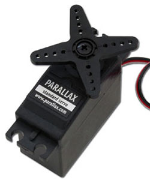
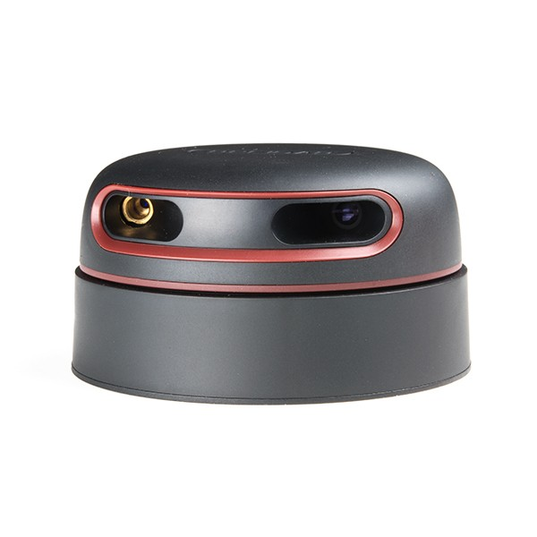
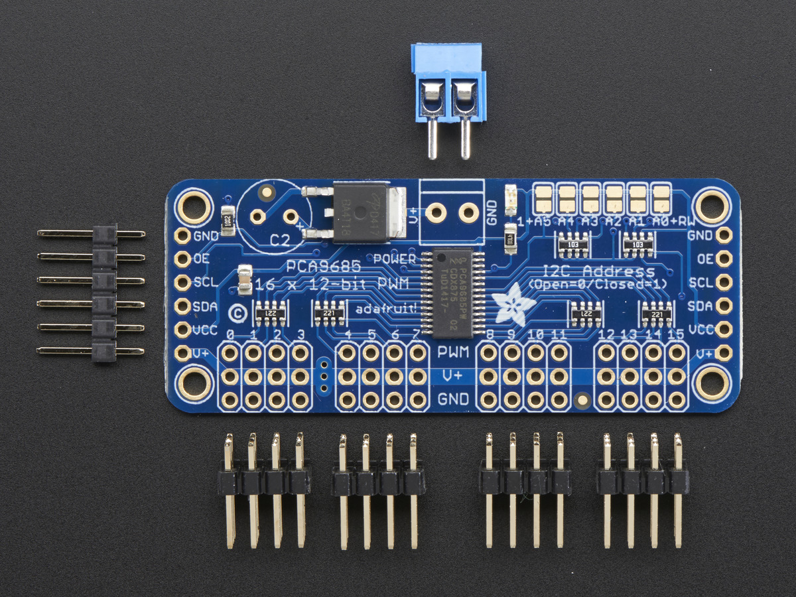
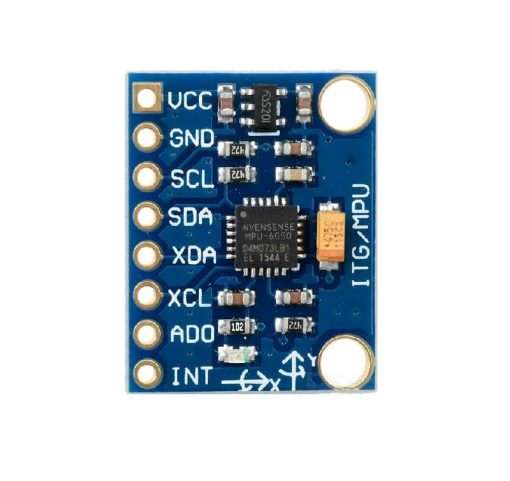
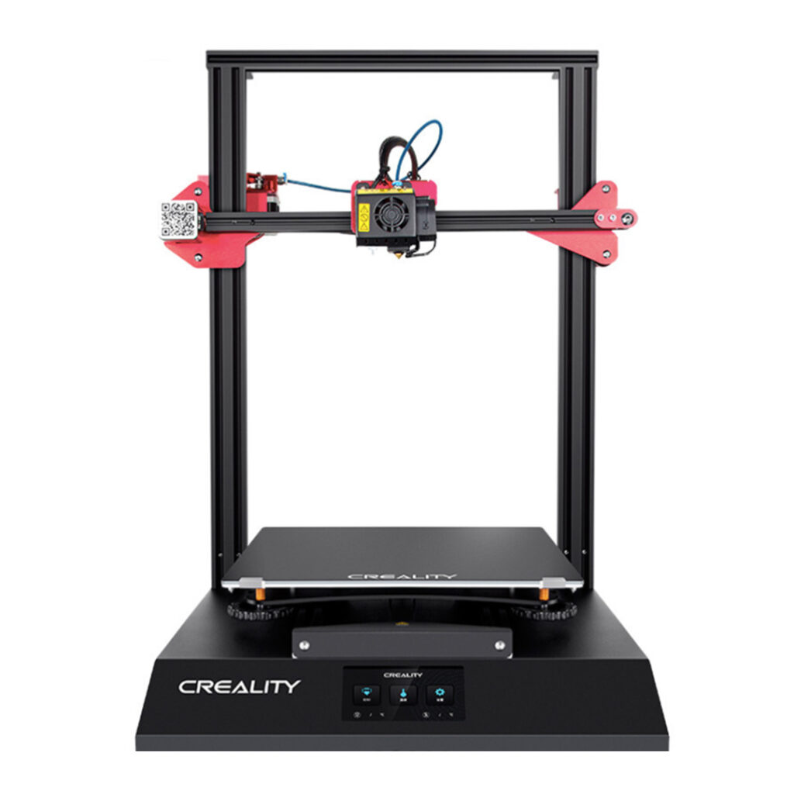

## Composants

### Raspberry Pi {width="100", align="right"}

Le Raspberry Pi est un nano-ordinateur monocarte à processeur ARM de la taille d'une carte de crédit conçu par des professeurs du département informatique de l'université de Cambridge dans le cadre de la fondation Raspberry Pi.

### Servomoteurs Parallax 
{width="100", align="right"}

{width="300"}

Un servomoteur est un moteur capable de maintenir une opposition à un effort statique et dont la position est vérifiée en continu et corrigée en fonction de la mesure.

### RPLidar 

{width="500"}

La télédétection par laser ou lidar, est une technique de mesures à distance fondée sur l'analyse des propriétés d'un faisceau de lumières renvoyé vers son émetteur.

Le lidar que j'ai utilisé viens de chez <a href="https://www.slamtec.com/en/lidar/a2">Slamtec</a>. De la catégorie RPLidar, j'ai utilisé le model A2, qui a une portée de détéction de 0.2m à 16m, ce qui est utile afin d'avoir un robot qui se déplace de manière autonome. Voltage à 5V, parfait pour le monter avec un raspberry pi. Enfin, la communication utilisée est le protocole <a href="../Protocoles"> UART</a>.

### PCA9685

{width="400"}

Ce module est un contrôleur de Servomoteurs PWM à 16 Canaux.

Ce module me sert à pouvoir plus facilement contrôler plusieurs servomoteurs en même temps. Il vient de la marque <a href="https://learn.adafruit.com/16-channel-pwm-servo-driver?view=all"> adafruit </a>

### MPU6050

{width="400"}

Ce module est un système micro-électromécanique (MEMS), il se compose d'un accéléromètre à trois axes et d'un gyroscope à trois axes.

### CR10-S pro v2
{width="100", align="right"}

{width="500"}

Imprimante 3D permettant d'imprimer les pièces du robot.