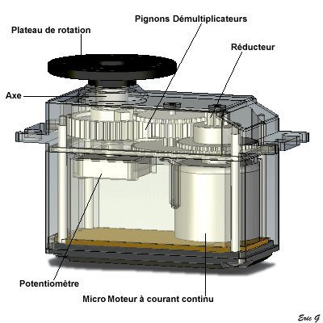

# Composants

## Raspberry Pi {width="100", align="right"}

Le Raspberry Pi est un nano-ordinateur monocarte à processeur ARM de la taille d’une carte de crédit conçu par des professeurs du département informatique de l’université de Cambridge dans le cadre de la fondation <a href="https://www.raspberrypi.org/">Raspberry Pi</a>.

## Pi camera 

{width="300"}

Ceci est un module de chez <a href="https://www.raspberrypi.com/products/camera-module-v2/">raspberry pi</a> qui me permet d’avoir un retour vidéo constant sur le robot. Ce module comprend un capteur Sony 8-megapixel. Du fait que c’est raspberry pi qui l’ai conçu, il n’y a qu’un ruban à brancher sur le raspberry pi.

## Servomoteurs Parallax 
{width="100", align="right"}

{width="300"}

Un servomoteur est un moteur à courant continu de petite taille, avec un réducteur à la sortie, afin de diminuer la vitesse, tout en augmentant le couple. Puis, dans les servomoteurs standard, il y a un potentiomètre afin de contrôler la position, mais dans les parallax 900-00008 il n’y a pas, car ce sont des servomoteurs, à rotation continue.

De ce fait, avec les servomoteurs standard on n’a qu’a mettre un angle, puis il y reste, alors que les nôtres, il faut le dire dans quel sens tourner, la force à avoir, et quand l’arrêter.
La communication avec le servomoteur ce fait grâce au PWM, il faut lui envoyer une impulsion entre 1,3 [ms] et 1 890 [ms], 1 500 [ms] étant le milieu, en dessous ça fait tourner dans un sens, au-dessus dans un autre sens.

{align="center"}

## RPLidar 

{width="500"}

La télédétection par laser ou lidar est une technique de mesures à distance fondée sur l’analyse des propriétés d’un faisceau de lumières renvoyé vers son émetteur.

Le lidar que j’ai utilisé vient de chez <a href="https://www.slamtec.com/en/lidar/a2">Slamtec</a>. De la catégorie RPLidar, j’ai utilisé le modèle A2, qui a une portée de détection de 0,2 m à 16m, ce qui est utile afin d’avoir un robot qui se déplace de manière autonome. Tension à 5V, parfait pour le monter avec un raspberry pi. Enfin, la communication utilisée est le protocole <a href="../Protocoles"> UART</a>.

## PCA9685

{width="400"}

Ce module est un contrôleur de Servomoteurs PWM à 16 canaux.

Ce module me sert à pouvoir plus facilement contrôler plusieurs servomoteurs en même temps. Il vient de la marque <a href="https://learn.adafruit.com/16-channel-pwm-servo-driver?view=all"> adafruit </a>. L’un des points positifs et le fait que j’ai choisi ce module, c’est qu’il ne consomme pas sur le raspberry, pour les servomoteurs, il a une alimentation différente, chose qui n’est pas à négliger quand on travaille avec autant de servomoteurs. Ce module communique avec le raspberry grâce au protocole <a href="../Protocoles">I2C</a> ce qui me facilite le câblage, en pouvant mettre les câbles en série.

## MPU6050

{width="400"}

Ce module MPU-6050 qui dessus à un gyroscope ainsi qu’un accéléromètre est improprement nommé gyroscope, car ce n’est pas un «vrai» gyroscope avec les anneaux, mais c’est un MEMS (MicroElectroMechanical Systems). Le fonctionnement de ce MEMS est qu’avec des mécanismes micrométriques réalisés sur silicium, elles sont mises en mouvement grâce aux forces générées par des transducteurs électromécaniques (dispositif servant de convertir un signal physique en un autre), et ce dernier fait l’interface entre la mécanique et l’électrique, et un circuit récupère ce signal et le transforme en signal numérique.

Ce module me permet d’avoir la position du robot à tout moment, ce qui m’est très utile afin de faire un PID pour le maintenir droit après les animations. Le gyroscope de ce module a une portée de mesure de +/-250° à +/-2000°, le robot n’étant pas censé se retourner complètement, j’ai choisi de mettre à la valeur la plus basse. Ensuite, l’accéléromètre du module a une portée de +/-2 G à +/-16 G, pour le projet je ne me sers pas de l’accéléromètre pour l’instant. Contrôler en <a href="../Protocoles">I2C</a> et prenant une tension de 3V3 ce module est parfait pour raspberry.

## CR10-S pro v2
{width="100", align="right"}

{width="500"}

Imprimante 3D permettant d’imprimer les pièces du robot.

L’imprimante de la marque <a href="https://www.creality.com/products/cr-10s-pro-v2-3d-printer">Creality</a> a été choisie, car ayant une grande surface, je n’allais pas être importuné pour la taille de mes pièces.