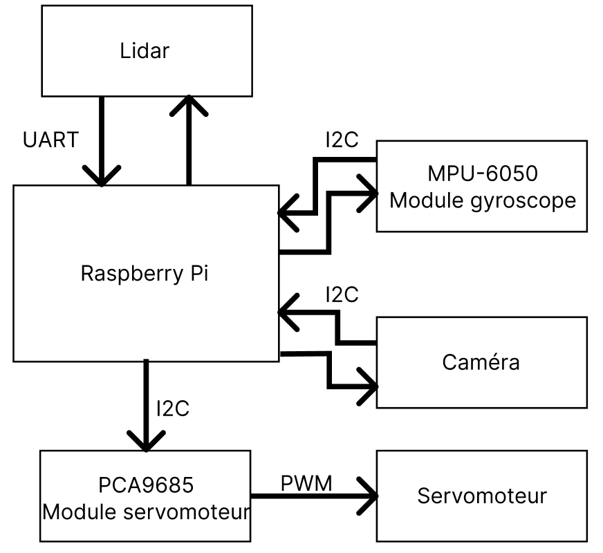
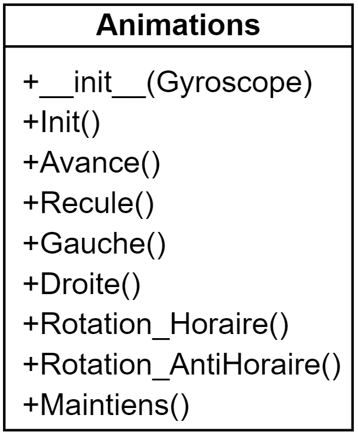

# Analyse des fonctionnalités majeures

Voici un schéma qui représente la communication entre les composants hardware et leurs protocoles de communication.

## Classe Lidar

Pour le projet j’ai placé le <a href="../Composants">lidar</a> sur le haut du robot, car si je le mettais en dessous j’allais toujours détecter les pattes ce qui nous enlèverait beaucoup trop de vision. Le lidar tourne en continu, car, ainsi les informations prennent moins de temps à être prises.

Ensuite, pour la programmation de cette classe, à l’initialisation du script «app.py» je lance le moteur du lidar, puis, de manière asynchrone, j’envoie les informations reçues du lidar dans une liste, ce qui les actualise régulièrement. Pour l’acquisition des données, il faut prendre toujours 2 tours du lidar, car au premier tour le lidar nous envois depuis sa position actuelle jusqu’à ~360°, donc si on veut avoir un tour complet sûr, nous avons qu’à enregistrer le tour complet d’après, c’est pour ça que je fais 2 tours. Puis dès qu’une classe en a besoin, elle appelle la fonction «Get_Data()» qui lui envois une liste des dernières valeurs recueillies.

{width="300"}

Comme vous pouvez le voir ci-dessus, cette classe est faite d’une propriété (ShorterScan), et de 4 fonctions. Je vais détailler ci-dessous ce que font ces éléments.

### ShorterScan : Float

ShorterScan est une propriété qui sert à ce qu’il y aie toujours la distance la plus proche entre le robot et un obstacle de disponible. Elle se met à jour dans la fonction «DoScan».

### \__init__()

Ceci est le constructeur de ma classe Lidar. Il initialise les valeurs, puis instancie un lidar.

### \__new__()

Cette fonction est utile, pour rendre les classes en singleton, afin de ne pas avoir d’autres instances du lidar dans le programme.

### Get_Data() : List

Dans cette fonction, je vérifie que la liste avec les données ne soit pas vide et s’il n’est pas vide je renvoie les valeurs, sinon un tableau vide.

### DoScan()

Au début de la fonction, j’initialise les valeurs et reconnecte le lidar. Ensuite, je lance un scan grâce à la fonction du module RPLidar «iter_scans», et j’entre les valeurs dans une liste vide, qui se remplit petit à petit. Puis dans ces valeurs là, je les trie et j’actualise la plus petite distance. Et finalement, quand il y a deux scans, j’arrête l’acquisition des données.

### StartLidar()

Cette fonction me sert à lancer le moteur au début du programme principal.

### StopLidar(Bool)

Cette fonction me sert à arrêter le lidar, dès que les données sont récoltées, et avec le paramètre je peux aussi arrêter le moteur, afin de faire un arrêt complet du lidar.

## Classe VideoCamera

Pour cette classe, j’utilise la librairie <a href="../Librairies">OpenCV</a>. Cette classe me permet de récupérer les données de la <a href="../Composants">caméra</a>.

{width="300"}

### \__init__()

Ceci est le constructeur de la classe VideoCamera, il instancie la caméra grâce à openCV.

### \__del__()

Cette fonction sert à libérer la caméra.

### get_frame() : bytes

Cette fonction capture le flux vidéo de caméra, la convertie en bytes et retourne celui-ci.

### QRCodeDetect() : Frame

Cette fonction sert à analyser le retour de la caméra et y chercher un QRCode, puis retourne une image avec le QRCode encadré en bleu.

## Classe Radar

Cette classe sert à créer la vue radar. Elle m’est utile pour créer une image avec les points que la classe lidar détecte et je l’actualise afin d’avoir un retour un minimum fluide. À l’initialisation, la classe dessine l’arrière-plan de l’image, les lignes pour les distances ainsi que mettre les chiffres pour que l’utilisateur sache de qu’elle distance il s’agit.

Ensuite, j’actualise seulement les points dans le but d’essayer de ne pas prendre trop de temps inutilement en redessinant des éléments futiles, et/ou permanents.

Voici un exemple de la vue que l’utilisateur voit :

{width="300"}

### \__init()

Cette fonction est le constructeur de cette classe. Elle me permet d’instancier matplotlib, puis initialiser les valeurs qui ne changent pas.

### CreatePlot(): Bytes

Cette classe me permet de remettre à jour la vue radar. Puis, j’envois la nouvelle figure à la classe principale qui l’affiche sur le site web.

## Classe Gyroscope

Afin d’utiliser correctement ce module, j’ai utilisé la librairie faite par le fabricant. Ce qui gère pour nous la communication entre le gyroscope et le raspberry pi. Ce qui rend les fonctions plus courtes et simples.

{width="300"}

### \__init__()

Cette fonction est le constructeur de la classe. Elle me permet d’instancier le capteur, ainsi qu’initialiser certaines valeurs.

### get_angle(): dict[str, float]

Cette classe permet récupérer l’inclinaison du robot grâce au gyroscope.

### get_acceleration(): dict[str, float]

Cette classe permet de récupérer les valeurs de l’accéléromètre.

## Classe ServoMoteur

Afin d’avoir une meilleure compréhension dans mes mouvements, j’ai fait une classe qui contrôle les servomoteurs.

Voici le diagramme de classe :

{width=300}

### \__init__(string, int)

Ceci est le constructeur de la classe qui initialise le servomoteur, sur le bon module PCA et à la bonne Pin.

Channel = "Gauche"/"Droite"

Position = 0 à 15

### SetAngleRel(int, int)

Cette fonction permet de définir l’angle du servomoteur avec une force donnée.
La force est entrée en pour cent.

Angle = -180 à 180

Force = 1 à 100

### StayWithForce(string)

Cette fonction permet de garder le servomoteur avec une légère force, grâce au paramètre nous pouvons décider dans quel sens.

### WithoutForce()

Cette fonction met le servomoteur sans force.

## Classe Patte

Cette classe me sert à faire les mouvements des parties des pattes plus simplement. Les fonctions font des actions précises, et que le nécessaire afin de créer des mouvements.

Voici le diagramme de la classe :

{width=300}

### \__init__ (string, string)

Ceci est le constructeur de cette classe. J’initialise les servomoteurs, de la patte selon le branchement hardware.

Le branchement a été fait en sorte que chaque groupe de 3 servomoteurs par patte soit facilement retrouvable.

Pour l’avant gauche:

 – La pointe: Pin 2
 – Le tibia: Pin 1
 – La Hanche: Pin 0

Pour le milieu gauche:

 – La pointe: Pin 4 
 – Le tibia: Pin 5
 – La Hanche: Pin 6

Pour l’arrière gauche:

 – La pointe: Pin 15
 – Le tibia: Pin 13
 – La Hanche: Pin 12

Pour l’avant droit:

 – La pointe: Pin 15
 – Le tibia: Pin 14
 – La Hanche: Pin 13

Pour le milieu droit:

 – La pointe: Pin 4
 – Le tibia: Pin 5
 – La Hanche: Pin 6

Pour l’arrière droit:

 – La pointe: Pin 0
 – Le tibia: Pin 1
 – La Hanche: Pin 2

### Lever_Pointe (int, int)

Cette fonction permet de lever la pointe de la patte à un angle précis et à la force donnée.

### Lever_Tibia (int, int)

Cette fonction permet de lever le tibia de la patte à un angle précis et à la force donnée.

### Baisser_Pointe (int, int)

Cette fonction permet de baisser la pointe de la patte à un angle précis et à la force donnée.

### Baiser_Tibia (int, int)

Cette fonction permet de baisser le tibia de la patte à un angle précis et à la force donnée.

### Tourner (int, int)

Cette fonction permet de tourner la patte à un angle précis et à la force donnée.

## Classe Animations

Cette classe permet d’avoir toutes les animations du robot. Chaque animation est détaillée étape par étape afin que la compréhension soit plus simple.

{width="300"}

### \__init__(Gyroscope)

Cette fonction est le constructeur de cette classe. Elle permet d’initialiser tous les servomoteurs, la communication I2C avec les modules PCA9685 et le gyroscope.

### Init()

Cette fonction est l’animation au démarrage du robot. Elle permet de lever le robot.

### Avance()

Cette fonction est l’animation qui permet de faire avancer le robot.

### Recule()

Cette fonction est l’animation qui permet de faire reculer le robot.

### Gauche()

Cette fonction est l’animation qui permet de déplacer le robot vers la gauche.

### Droite()

Cette fonction est l’animation qui permet de déplacer le robot vers la droite.

### Rotation_Horaire()

Cette fonction est l’animation qui permet de faire une rotation de sens horaire au robot.

### Rotation_AntiHoraire()

Cette fonction est l’animation qui permet de faire une rotation de sens antihoraire au robot.

### Maintiens()

Cette fonction permet de laisser le robot debout sans bouger, et le remettre droit, grâce aux PID pour les axes X et Y du gyroscope.