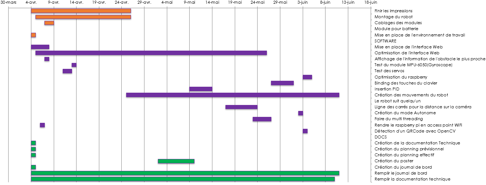
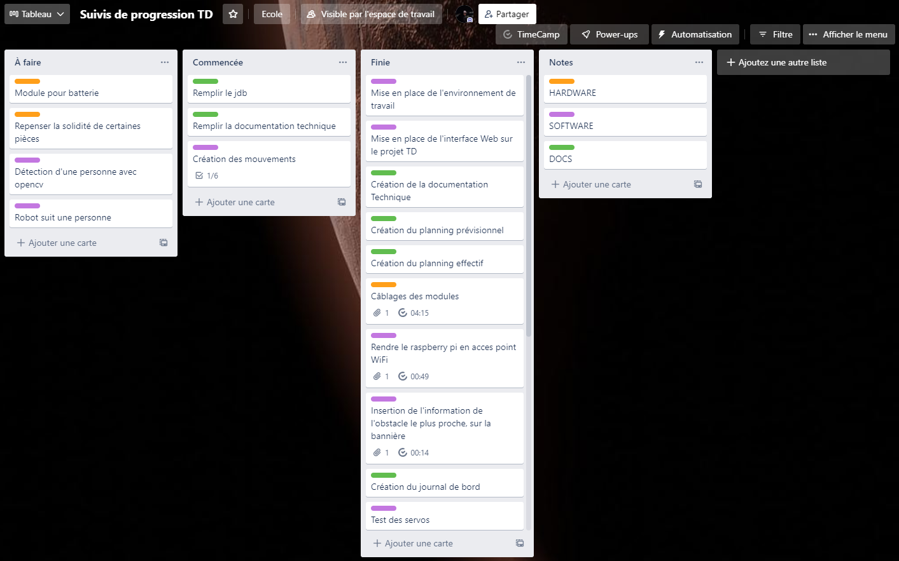

# Gestion du projet

## Planning

Afin de pouvoir faire le planning prévisionnel, j'ai utilisé un diagramme Gantt qui se présente comme ceci:

{width=900}

Dans ce planning, j'ai mis les grandes étapes que je pensais les plus utiles mais comme vous pouvez voir en comparaison avec le planning effectif, beaucoup plus de tâches ont été ajoutées. Et ce manque de préparation m'as porté préjudice durant la conception du robot.

{width=900}

## Gestion du projet

Durant la réalisation de ce projet, j'ai utilisé l'outil Trello. Trello m'a servis à utiliser une méthode Kanban. Ceci marche en faisant des cartes qui représentent les tâches que l'on doit faire. Puis, les cartes, il faut les mettres selon l'avancement de la tâche. Pour mon cas, j'ai séparé ça en trois parties:

- À faire
- Commencée
- Finie

Voici comment est représenté mon Trello:

{width=900}