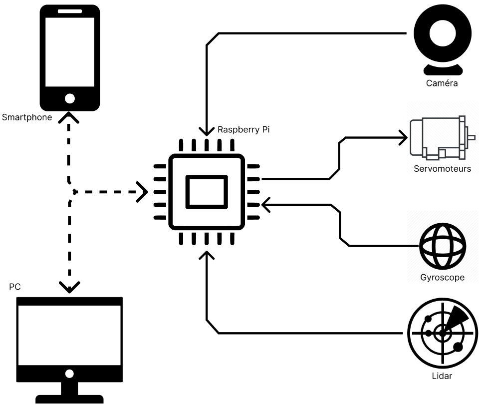
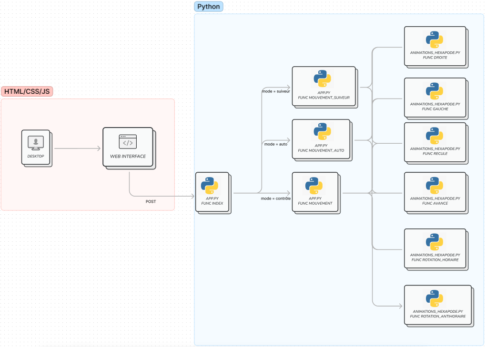
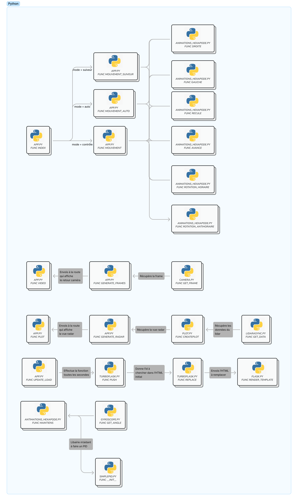

# Introduction

The Big Bug est un robot hexapode contrôlé à distance, qui grâce à plusieurs capteurs, peut se déplacer dans toutes les directions. Ce projet est séparé en deux grandes parties. 

La première, la conception du robot. Cette partie englobe tout ce qui est la création mécanique du robot, l’assemblage, et programmer l’intelligence de celui-ci. La deuxième est la gestion du robot. Cette partie prend en compte l’interface web, la communication entre les classes, la récupération des données, et les utiliser.

Ci-dessous, voici un diagramme démontrant l’architecture de communication en général. L’utilisateur (représenté à gauche par un smartphone ou par un pc) se connecte au raspberry pi grâce à l’access point, puis à l’interface web qui sert à faire la gestion du robot, avec qui on peut contrôler la direction de la marche du robot, et récupérer les données des capteurs (représentés sur toute la partie de droite), pour ensuite les afficher sur l’interface. Pour chaque capteur, le raspberry pi communique avec le protocole approprié ce qui favorise la vitesse la communication. Puis, la communication entre l’utilisateur et l’interface se fait grâce à WSGI (Web Server Gateway Interface) qui sert à faire une interface entre des serveurs et des applications web pour le langage Python.

{width=700}

Le frontend de l’application est une page web, affichée localement. Pour cela, j’utilise les services HTTP de Flask présents sur le raspberry pi. La page web communique ensuite dans les deux sens à travers le code Python afin d’interagir avec le backend Python et afficher les résultats à l’utilisateur et/ou faire bouger le robot comme l’aura souhaité l’utilisateur. 

Le backend est composé d’une fonction qui attend les requêtes Post et dépendamment de la requête, il réagira comme souhaité voici un diagramme qui représente cela:

{width=700}

Ce système permet de contrôler selon l’interaction de l’utilisateur, les modes changent, et dépendamment du mode, soit l’utilisateur contrôle les mouvements, avec le clavier ou en ayant un QRCode où le robot le suivra, sinon dans le mode autonome. Le raspberry pi se sert des données que lui rend le lidar, pour savoir dans quel sens il doit aller. Il fera une analyse des distances et verra où il a le plus de place pour marcher et si la plus grande distance pour marcher.

Dans ce projet, afin que ce soit plus simple pour s’y retrouver j’ai essayé de séparer un maximum les différents éléments du backend. Il y a les éléments que nous avons vus précédemment qui nous servent pour le mouvement de l’hexapode. Ensuite, nous avons la partie qui retransmet le retour caméra. À la suite, nous avons tout l’acheminement de la création de la vue radar, avec la récupération des données du lidar, qui sont envoyées à la classe qui créer le dessin de la vue. Ensuite, l’envoi sur le script principal qui l’enverra à la fin sur la page web. Ensuite, il y a toute la partie qui sert à mettre à jour les valeurs récupérées des capteurs qui sont affichées sur la bannière du haut. Et enfin, la partie qui gère le PID du robot, afin qu’il puisse se maintenir droit.

{width=500}

Ensuite pour plus de précision de comment fonctionnent mes classes indépendamment, je vous laisse allez voir <a href="../Fonctionalite">ici</a>.