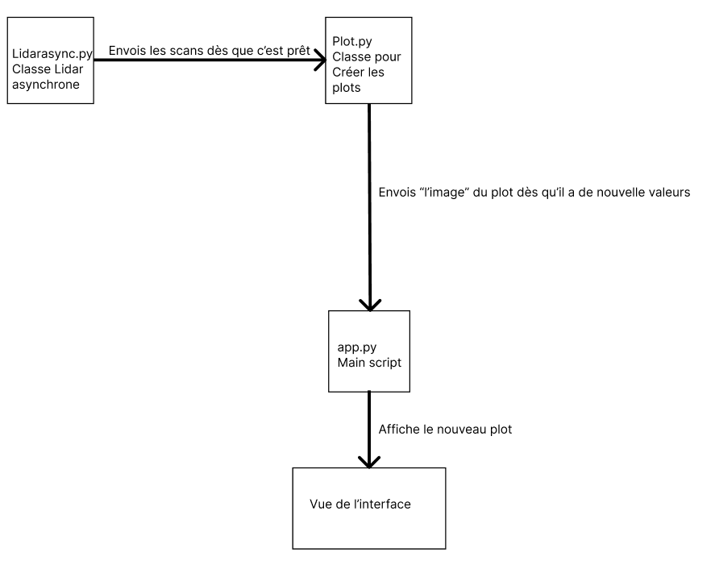
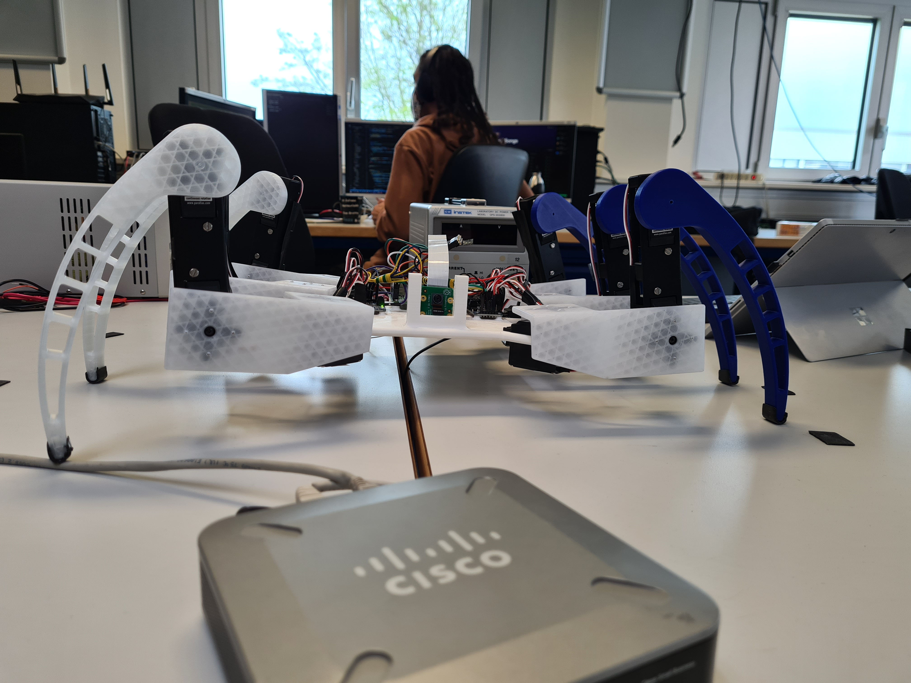
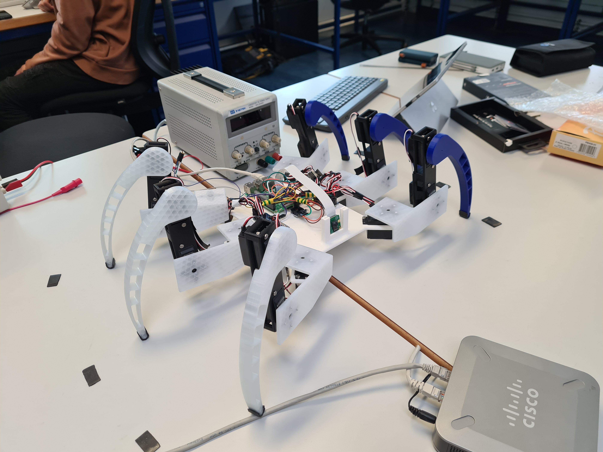
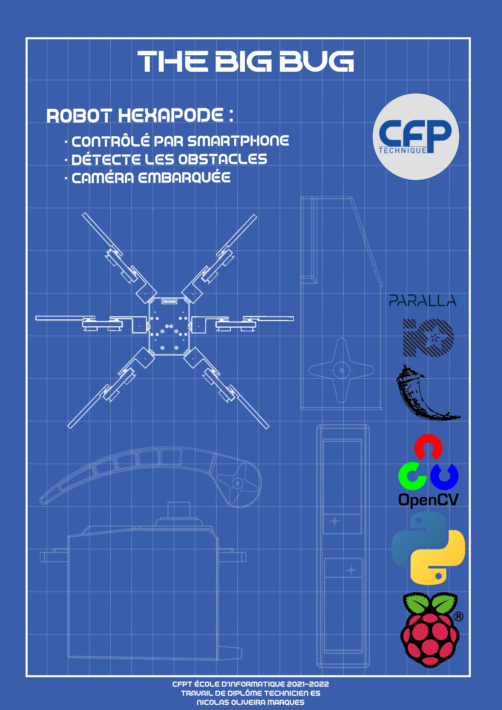
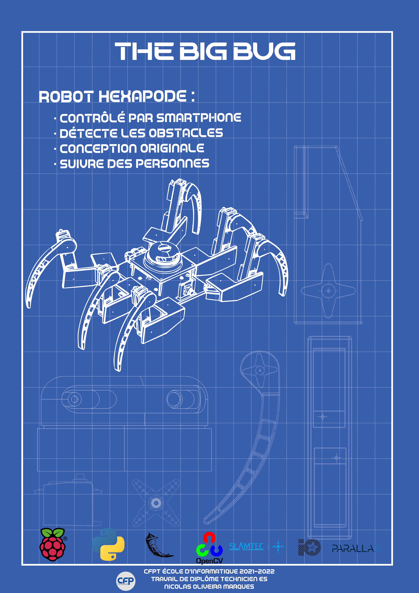
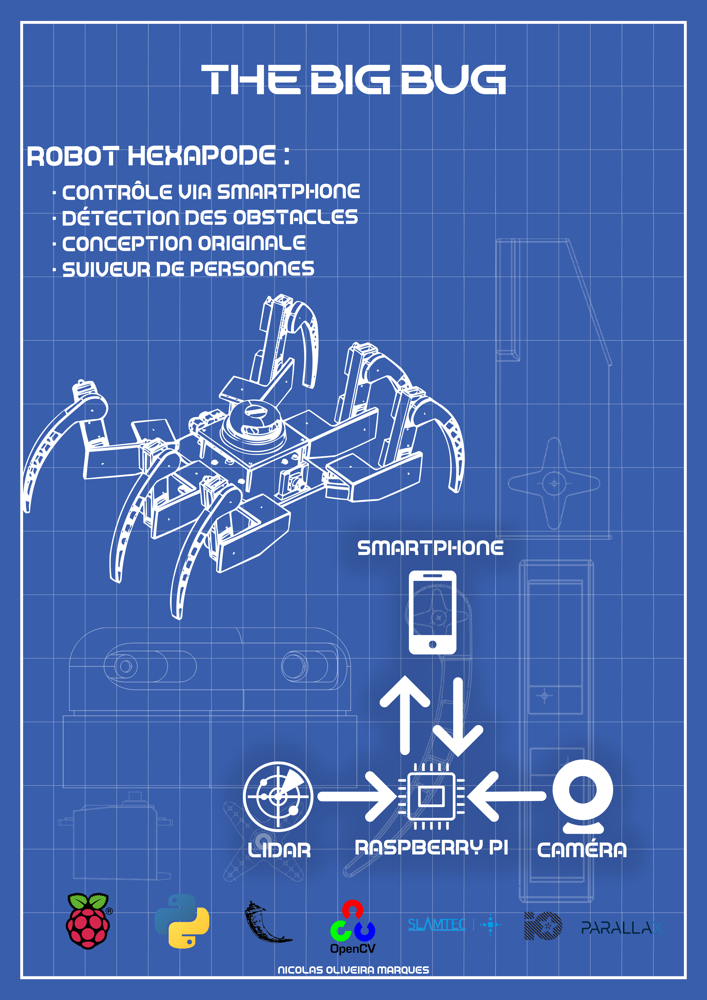
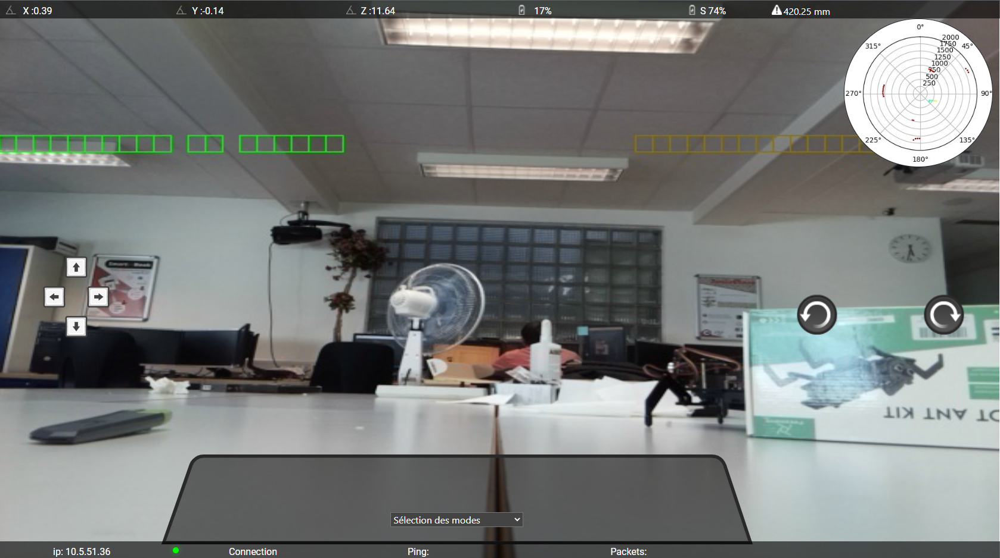

# Journal de bord
## Avril
### 04.04.2022

Aujourd’hui, nous avons eu une petite introduction faite par M. Bonvin et M. Garcia sur le déroulement général du travail de diplôme. Ensuite, j’ai commencé à préparer mon environnement de travail, faire un planning prévisionnel (chose dont je ne suis pas très bon, car je n’arrive pas souvent à préparer ce que j’ai à faire en avance.), un Trello avec mes tâches puis finalement faire le git afin que mon professeur, qui me suit durant le travail de diplôme (M. Bonvin), puisse suivre mon avancée. Durant cette première journée, on peut donc dire que j’ai juste tout bien préparé afin de commencer sérieusement le TD. À la fin de la journée, nous avons eu une visite à l’HEPIA.

### 05.04.2022

Ce matin, j’ai commencé par essayer de régler le souci que j’avais déjà sur l’interface Web, qui était que je prenais trop de temps pour afficher la vue radar. Ce qui m’a pris toute la matinée en essayant moult méthodes différentes, et finalement, je n’ai pas réussi à finir l’optimisation, car M. Bonvin est venu me parler de la mécanique du robot. Puis, j’ai donc commencé à visser les parties que je pouvais du robot. Enfin, à la fin de la journée, M. Bonvin est venu pour me parler d’une technique afin de savoir où se situent les pattes, grâce à l’accéléromètre et grâce au gyroscope. La technique consiste à mettre le robot sur une surface plate, lever les pattes, et de prendre ce point comme le point 0, et ainsi tester les moteurs les uns après les autres, et ainsi, on peut savoir quand ils touchent le sol et déterminer leurs positions à tout moment. Durant son explication, M. Bonvin a remarqué que les hanches du robot, n’étaient pas solidement attachées au reste du robot. On a commencé à penser pour résoudre ce souci, et l’idée la plus prometteuse est de prendre un servomoteur en métal afin qu’il y ait le moins de jeu possible.

### 06.04.2022

Aujourd’hui, j’ai passé ma journée à essayer de résoudre le problème avec l’interface Web. Malheureusement, je ne comprends pas pourquoi le plot, pour faire la vue radar, ne veut pas fonctionner. J’ai regardé dans l’inspecteur du navigateur et je voyais que les images prenaient beaucoup trop de temps à être téléchargées (environ 2 à 5 secondes) et je ne sais pas s’il faut compresser les images pour que ça s’envoie plus vite, car au niveau du raspberry pi il n’est pas surchargé.

### 07.04.2022

Ce matin, je continue à essayer de résoudre le problème de la vue radar, sauf que rien ne marche, les images prennent encore trop de temps à arriver au navigateur. J’ai donc décidé de laisser ça de côté et attendre que M. Bonvin puisse m’aider sur ce problème, et j’ai commencé à afficher l’information de la distance de l’obstacle le plus proche sur la bannière sur le haut de l’interface.
À midi, M. Bonvin est passé dans la classe et m’a ramené des caisses remplies de composants de chez lui, ainsi que les connecteurs afin de faire les rallonges pour les servos. Ensuite, il m’a expliqué en très rapide ce qu’il fallait faire pour résoudre mon souci:
- Faire une classe externe qui gère la création des plots
- On s’en fiche du Web et on fait en sorte que ça créer les plots hors Web.
- Dès que tout fonctionne, intégrer cette classe dans le Web
- Faire une documentation de cette classe et expliquer tout ce que je fais au mieux

En regardant mon trello, je trouve que je passe beaucoup trop de temps sur ce problème avec les plots. Il faut donc que je le règle au plus vite. Je pense refaire comme pour le travail de semestre et travailler le soir chez moi pour faire en sorte que ça marche.
Après les cours, j’ai fait le programme que m’avait dit M. Bonvin, et j’ai remarqué que le message «Start» du lidar prenait trop de temps à venir, et j’ai vérifié en mettant plein de timers et matplotlib prends 5.51 secondes à être importé alors que les autres 5 mS. Il faudrait donc que je m’informe envers M. Bonvin sur ce qu’il prend autant de temps et pourquoi.
### 08.04.2022

Ce matin, j’ai continué à travailler sur le débogage de la vue radar, et M. Bonvin m’a appelé en me disant de faire un autre script, et m’a dit de prendre le code d’exemple. Puis, ne voyant toujours pas le bout de la solution à ce problème, j’ai commencé à faire le câblage pour les rallonges des servos moteurs, car aujourd’hui, j’ai reçu la commande avec les gaines thermorétractables. Ensuite, je les ai essayées, en regardant dans les pires positions voir si tout était assez long, et tout est comme il faut. Puis, vers la fin de la journée, je me suis réattaqué sur la solution de la vue radar. En testant, j’ai vu que même avec l’exemple cela prenait 30 secondes pour avec 400 scans. Mais en regardant ce qu’il y avait dans les 400 scans, il y avait 400*360°, ce qui est problématique. J’ai essayé alors avec 1 seul scan, il y manque beaucoup d’information, car il prend que de là où il est en ° jusqu’à ~360°. De ce fait, pour être sûr d’avoir toutes les infos, 2 scans sont nécessaires, ce qui prend 0.46 seconde.

### 11.04.2022

Aujourd’hui, j’ai continué à travailler sur le programme pour le lidar. Ensuite, pendant la matinée, M. Bonvin m’envoie un mail, en me disant d’utiliser une autre librairie pour communiquer avec le lidar, et de le faire marcher parfaitement. Au début, j’avais plein de problèmes, car le baudrate n’était pas le bon (il avait spécifié dans son mail, d’essayer de prendre le baudrate le plus rapide.), alors je suis allé voir dans la documentation qu’il m’avait envoyée aussi, et elle n’explique pas grand-chose, elle ne fait qu’une brève présentation des fonctions, sans vraiment dire comment elle fait. Mais dans l’après-midi, j’ai réussi à régler le souci. Ensuite, j’ai essayé d’en faire une classe et de faire une version asynchrone, car je pense que ça serait très utile que le lidar soit en asynchrone, afin que dès qu’il a de nouvelles données, il envoie à la classe matplotlib, et celle-ci créer le plot et l’envoi sur l’interface. Comme représenté dans le schéma ci-dessous.

Et enfin, à la fin de la journée, j’ai décidé d’avancer le câblage du robot. Avec du veroboard, j’ai soudé tous les câbles utiles pour l’I2C (SDA et SCL). Et demain, je vais faire la même chose, mais pour les alimentations des modules, ainsi, je pourrais tester les modules des servos moteurs et commencer à faire bouger le robot.

### 12.04.2022

Aujourd’hui, j’ai commencé la journée et continuant de transformer ma classe Lidar en asynchrone. Puis avec certains problèmes, j’ai décidé d’avancer le câblage et de le finir, car ainsi, je pourrais commencer à travailler sur les servos. Dès le début de l’après-midi, j’avais fini avec le câblage, et j’ai commencé à tester les servomoteurs. Ils marchent tous correctement. Mais, habitué à n’avoir que des servos non continus, j’ai un peu peiné au début, pour les faire bouger. Ils se tapaient sur tout, car ils allaient toujours de la min au max, ou du max au min, mais jamais le degré que je voulais. Ensuite, je suis allé voir la documentation de la librairie adafruit, et ils expliquent implicitement comment ils fonctionnent. J’ai calculé, ensuite, le temps que prennent les servos pour faire un degré:

En 1 min le servo fait 50 tours, il faut donc savoir combien de temps pour 1 tour. Une simple règle de 3 pour le trouver, ce qui nous donne 1.2 seconde pour un tour. Ensuite, il faut juste diviser ce 1.2 seconde par 360 pour savoir le temps pour faire 1 degré, ce qui nous donne 0.003 seconde. Puis, j’ai préparé un code conséquent et faire certains tests avec les servos. Et à la fin de la journée, j’ai demandé conseil à M. Bonvin, et il me conseilla sur ce que je dois faire.

Je pense qu’en Off chez moi, j’imprimerais certaines pièces de la façon dont il m’a expliqué, afin de réduire le poids des pièces.

### 13.04.2022

Aujourd’hui, j’ai commencé ma journée en faisant des tests sur le module gyroscope/accéléromètre. J’ai eu quelques soucis pour trouver la bonne adresse, j’ai dû chercher dans la documentation technique, mais il n’y avait pas pour le module. Ce que j’ai fait, c’est que je suis allé chercher dans tous mes projets d’électronique, et j’ai réussi trouvé dans un dossier caché au milieu de tous mes dossiers, un ancien programme qui utilisait ce module et I2C et j’ai réussi à trouver l’adresse. J’ai testé voir s’il marchait correctement, et tout m’as l’air assez juste. Ensuite, durant l’après-midi, j’ai continué à travailler sur les servomoteurs. En branchant 2 pattes, je voyais qu’il arrivait déjà à soulever, mais légèrement, et les servos du milieu chauffent pas mal, alors j’ai testé avec une troisième patte, et là, tout le corps du robot, c’est soulevé avec aisance. Cela m’a fait très plaisir, car je me dis que finalement (sans le poids des batteries et du lidar) il arrive à soulever le robot! Je pense donc essayer durant toutes les vacances à faire des pseudoanimations, ou du moins réussir à le soulever complètement.

### 18.04.2022

Aujourd’hui, j’ai avancé la documentation technique avec ce que j’avais déjà, ainsi qu’expliqué les différents protocoles de communication que j’utilise.

### 25.04.2022

Aujourd’hui, j’ai continué à essayer de tester les servos, surtout voir quelle force minimale j’ai besoin pour qu’elles lèvent la patte. Et ensuite, dès que j’ai trouvé cette information (car ça m’a pris un bon bout de temps de faire sur chaque patte), j’ai pris une feuille, mon programme de test des servos où je peux mettre leurs angles, et faire les animations étape par étape. Mais malheureusement, vu que je n’ai pas encore reçu le reste de mes pattes, je ne peux pas finir correctement les animations, je suis donc bloqué sur cette étape, et heureusement que ce problème est arrivé en fin de journée sinon j’aurais vite perdu une journée de travail.

### 26.04.2022

Ce matin, M. Bonvin est venu nous donner les feuilles afin qu’on se fasse une auto-évaluation par rapport à notre façon de travailler sur le projet et autres. Puis, M. Garcia est venu aussi pour ces élèves et il m’a dit de relancer M. Muccioli pour les pièces 3D, chose que j’ai faite, et heureusement qu’on l’a fait, car il attendait une confirmation sur son e-mail edu.ge.ch, j’ai donc rédigé un mail de confirmation, avec le peu d’information dont je me souviens. Ensuite, il m’a très vite répondu, en me disant que demain elles seraient prêtes (28 heures d’impression), de ce fait demain à la grande pause, j’irais les chercher. Mais ça me ralentit pour mes tests, je ne vais donc pas rester en train de ne rien faire, je pense que le reste de la matinée, je vais faire en sorte que les câbles sur le robot, soient bien rangés, enfin avoir un bon câble management, afin de pouvoir s’y retrouver.
Au début de l’après-midi, j’ai branché et testé les servos du côté droit du robot. Ensuite, j’ai avancé la documentation, afin d’expliquer les servomoteurs, comment fonctionnent-ils, et ce que j’en fais. Puis M.Bonvin est venu pour me rendre son bilan sur les deux premières semaines, ce qui n’a pas été concluant pour lui, et dans la discussion nous avons décidé que le vendredi, je dois rendre la classe Lidar asynchrone fonctionnelle.

### 27.04.2022

Ce matin, j’ai commencé à travailler sur la classe du lidar en asynchrone. J’ai plein de problèmes et d’incompréhension par rapport à l’asynchrone, j’essaye plein de façons différentes, mais rien ne marche, il y a toujours une erreur, ou une mauvaise valeur. Ensuite, je suis allé chercher à la grande pause, les nouvelles pièces imprimées à butin. Puis jusqu’à la fin de la matinée, je les ai montées, puis refais le câble management. Au début d’après-midi, j’ai recommencé à travailler sur l’asynchronisation de la classe lidar, et je n’y comprends toujours rien, j’essaye encore des façons différentes, et que des erreurs différentes. Puis, M. Aigroz, vers la fin de la journée il est passé dans la classe voir comment ça allait, et il m’a beaucoup aidé avec les mouvements des servos afin de faire bouger le robot. Ensuite, il m’a aussi très bien expliqué ce que je dois faire pour la classe lidar, et de ce que j’ai compris, il faut que je fasse en multithreading et non en asynchrone, car en asynchrone il bloque quand même le code jusqu’à recevoir les données, alors qu’en multithreading, il fait une copie et lance un autre process sur un autre thread pendant que notre programme principal tourne toujours.

### 28.04.2022

Ce Matin, j’ai vu le mail que M. Bonvin m’avait envoyé hier qui m’aidera à mieux comprendre l’asynchrone ou le multithreading. J’ai donc passé les deux premières heures à lire et essayer de comprendre ce cours tout en essayant avec mon programme [lien du cours] (https://leimao.github.io/blog/Python-Concurrency-High-Level/). Ensuite, à la grande pause, M. Bonvin est venu afin de nous aider, et m’as expliqué aussi ce dont j’ai besoin de comprendre dans tout ce cours, et que du ce fait, je ne dois qu’utiliser des threads. Puis, un petit remontage de bretelles, car il me demandait des informations basiques que je n’avais pas de tête et je comprends que pour la présentation il faut que je sois vraiment à jour sur cela. Durant l’après-midi, j’ai continué à essayer de faire le multithreadings, sauf qu’il y a encore des problèmes. Je lance un timer qui doit lancer toutes les secondes, la fonction du lidar pour scanner, sauf qu’il ne le fait pas, je me suis dit qu’il devait se bloquer dans une boucle, je regarde en mettant des print un peu partout, mais non, aucun blocage, juste le thread «timer» se lance une fois, et pas toutes les secondes. Je vais essayer de trouver la solution demain sinon j’aurais un problème avec M. Bonvin.

### 29.04.2022

Ce matin, j’ai continué à travailler sur la classe Lidar, et j’ai testé en faisant une fonction qui incrémente un chiffre et pas directement avec le lidar. Ce qui m’a donc permis de voir que le Timer ne passait qu’une fois et pas plus. J’ai alors cherché pourquoi il faisait ça, et de ce que j’ai cru comprendre, le Timer en python ne sert que pour lancer une fonction, mais avec un délai, et pas une répétition avec un intervalle. J’ai cherché comment le faire répéter, et tester et ça marchait bien. Ensuite, dès que le Timer a marché, j’ai eu un souci avec le lidar, plus particulièrement le port. Une erreur me disait que le port n’était pas ouvert, mais dans mon code je disais au lidar qu’après chaque scan qu’il devait se déconnecter, mais je ne le reconnectais pas. En réglant, ce souci tout allait pour le mieux, et je faisais en sorte que tout marche comme il faut. Durant l’après-midi, j’ai fait l’assemblage de l’hexapode sur solidworks, car je vais essayer de faire ce que m’as dit M. Aigroz, qui est de modéliser, faire les mouvements, et grâce aux animations reprendre les valeurs et les retranscrire sur le code, et ainsi si je veux rajouter des animations, je n’ai qu’à les faire sur solidworks et retranscrire les valeurs denouveaux.

### 30.04.2022

Aujourd’hui, j’ai passé ma journée à essayer de faire les animations avec solidworks sauf qu’il y a un problème et je n’arrive pas à le faire bien fonctionner, il y a un composant dans les pièces du servomoteur sont fixés, et afin de faire des animations correctes, il faut que je puisse les libérées, mais l’option n’apparaît pas, j’ai cherché sur Internet, mais je ne trouve pas de solution. La solution que j’ai trouvée un peu plus tard, c’est de prendre un autre fichier 3D des servos, et rassembler le robot. Ensuite, il y avait un problème, car quand je fais bouger le Tibia dans l’animation, la pointe ne suit pas comme en vrai. 

## Mai

### 02.05.2022

Ce matin, j’ai continué à essayer de faire l’animation sur solidworks. J’ai vu qu’en mettant une contrainte en plus je pouvais faire bouger la pointe comme je le voulais, mais après dans la partie de l’animation, ça me faisait plein de problèmes, la contrainte faisait en sorte que dans l’animation plus rien ne bouge, chose que je ne comprends pas vraiment pourquoi, j’ai donc essayé d’activer ou désactiver grâce à l’animation, mais ça ne marchait pas. Ensuite, j’ai essayé de construire le tout sur Unity, mais ce n’était pas possible, car je n’ai pas une connaissance assez grande de Unity pour changer le point 0 d’une pièce. J’ai décidé alors d’arrêter de vouloir faire des animations préparées et de les faire en code directement. Durant l’après-midi, j’ai continué les deux premières heures à essayer de faire lever le robot en code, sauf que les pattes du robot glissent trop, et je n’arrive pas à les faire lever correctement. Puis, le reste de la journée, j’ai avancé la documentation technique.

### 03.05.2022

Aujourd’hui, j’ai passé la journée à essayer de faire monter le robot, depuis une position initiale. J’ai dû faire vraiment petit à petit, c’est assez lent pour faire les animations comme ça, mais il faut le faire. Durant l’après-midi, j’avais une version presque réussie de ce mouvement, sauf que vers la fin de l’animation, les servos faisaient des spasmes. J’ai décidé alors de prendre une autre alimentation, et de tester. Je suis assez surpris, car les servos du côté gauche sont très nerveux maintenant, et ceux du côté droit plus lent j’ai l’impression.

### 04.05.2022

Aujourd’hui, j’ai commencé la journée par tester la technique de M. Bonvin pour lever le robot. Forcer sur les deux pattes avant, ensuite sur les deux pattes arrière, et dès que c’est levé, ajouter les pattes du milieu pour la stabilité. À ma surprise, il a de la peine à se lever. Je pense donc continuer à utiliser la technique des 6 pattes en même temps. Et en parlant avec mes camarades, ils m’ont rappelé qu’il fallait faire le poster, pour que demain M. Bonvin puisse les examiner, comme ça on peut les changer jusqu’à lundi. Faire le poster, m’a pris toute la journée, et demain, j’essayerai de faire l’abstract, comme ça tout ce dont j’ai à rendre sera fait, et je pourrai me concentrer sur le robot.

### 05.05.2022

Aujourd’hui, au début de la matinée, j’ai continué à travailler sur l’animation d’initialisation du robot. Puis, après la grande pause, M. Bonvin, est venu, pour qu’on lui montre nos posters, et de ce fait, je lui aie montré le mien, et étonnement, il a été assez gentil, et il m’a juste dit que je devais changer quelques détails et rajouter le dessin du lidar sur le poster, ce que j’ai fait jusqu’au début de l’après-midi. Ensuite, j’ai recommencé à travailler sur le robot, et je me suis dit qu’il faudrait utiliser le gyroscope afin de savoir quand le robot est droit. En testant, j’ai eu un très joli résultat:

 {width="700"}

 {width="700"}

Et ce résultat sans le gyroscope. J’ai implémenté le gyroscope après ce résultat-là.

### 06.05.2022

Ce matin, j’ai continué à travailler sur l’implémentation du gyroscope sur le mouvement d’initialisation, sauf que le gyroscope me rend des valeurs, on dirait de l’aléatoire. Je peux passer de -3° à 20°. Puis, j’ai fait quand même quelques essais, et ils étaient assez concluants, le robot était droit. Mais plus j’essayais, moins ça marchait. Je pense que lundi, il faut que j’implémente une façon pour ne pas forcer sur tous les servomoteurs en même temps, et les faire forcer 2 par 2 ou patte par patte, cela très rapidement, ainsi, je consommerais moins. Même si les servos veulent consommer plus, ils auront de la marge. Cette après-midi, j’ai continué à travailler sur les mouvements, et j’ai essayé de faire avancer déjà une patte, mais le robot ne se lève pas assez haut. Je dois donc le faire monter assez pour que la patte puisse bouger aisément. Puis, comme j’ai dit ce matin, plus je force sur les servos en un temps court, plus j’ai l’impression qu’ils ont de la peine à forcer. Ce weekend, je vais essayer d’avancer un maximum la documentation, car lundi nous devons rendre le poster et la documentation ainsi que le résumé/abstract. J’ai déjà fait le poster. Je me suis inspiré du blueprint d’Iron Man. Mon poster ressemble à un dessin technique avec toutes les pièces en 3D que j’ai réalisé, avec aussi les logos des librairies/composants les plus importants.

V1 du poster:

 {width="700"}

Il y a le robot en 2D avec les pattes tendues, mais quand M. Bonvin a vu, il m’a conseillé de plutôt mettre une vue en 3D en position. Voici donc la V2:

 {width="700"}

### 09.05.2022

Aujourd’hui, j’ai envoyé mon poster ainsi que mon abstract à M. Bonvin. Il m’a demandé de l’appeler, puis on a fait un débrifing par téléphone. Il m’a dit que le poster était pas mal, sauf que je ne présente rien d’informatique, je ne montre que des pièces mécaniques. Il m’a alors conseillé de faire un schéma qui explique ce qui communique ensemble, et de l’ajouter sur le poster. Ensuite, pour l’abstract, il m’a dit que mon français n’était vraiment pas bon, ce que je conçois, car j’ai écrit comme je pense. Il m’a ordonné de ne rien faire d’autre que ces deux choses toute la journée, ce que j’ai fait. 
Voici donc la version finale de mon poster:

 {width="700"}

### 10.05.2022

Aujourd’hui, j’ai aidé un moment durant la matinée un camarade, car il avait besoin d’aide sur certaines notions d’électronique. J’ai donc passé un moment avec lui pour l’aider et l’orienter sur les bons choix. Ensuite, avec M. Hürlimann, nous avons eu notre réunion avec M. Bonvin. Heureusement, on ne reçoit pas la lettre chez nous, mais il faut que l’on s’active beaucoup plus, car on n’a rien de présentable pour l’instant. Durant l’après-midi, j’ai commencé à travailler sur les mouvements du robot, mais avec la classe «Patte», sauf que j’ai vite remarqué qu’en fait, cette classe mets inutile, car j’ai besoin de contrôler plusieurs pattes en même temps, et pas une à la fois. Je suis alors reparti sur le programme de base pour les animations, et j’ai remarqué que c’était très bizarre les valeurs que je recevais du gyroscope, je suis alors allé essayer, mais avec une boucle qui me montre en continu ce qu’il se passe. J’ai remarqué que les valeurs ne bougeaient plus dès que je bougeais plus le robot dans mes mains, alors que si je le bouge, là les valeurs changent. J’ai ainsi compris, que la librairie que j’utilise pour communiquer avec le MPU6050, avait inversé entre le gyroscope et l’accéléromètre. Ensuite, j’ai expliqué à M. Bonvin ce que je voulais faire, qui est d’utiliser le gyroscope pour stabiliser le robot, et ainsi qu’il peut lui-même mettre plus ou moins de puissance sur les servos. Il m’a alors parlé de boucles d’asservissement (je connaissais ce terme seulement par PID), connaissant la difficulté de faire un système asservi, j’ai fait mes recherches sur le Web, je n’ai rien qui m’explique bien la marche à suivre en programmation d’un PID, mais je pense savoir un peu près comment le faire.

### 11.05.2022

Aujourd’hui, j’ai passé toute la matinée à relire le fonctionnement du PID. J’ai demandé de l’aide à certains professeurs, et beaucoup m’ont dit de ne pas me lancer dans ça, et plutôt utiliser une librairie qui le fait pour moi. L’après-midi, j’ai essayé d’implémenter la librairie simple-pid, qui fait les calculs pour le PID à ma place. Mais je ne comprends pas où je dois mettre les valeurs qui me ressortent. J’ai fait quelques tests avec le robot, et soit il a le parkinson, et tous les servos tremblent dans tous les sens, soit il dit comme quoi c’est le plus juste et sort de la boucle du pid directement.

### 12.05.2022

Aujourd’hui, j’ai continué à implémenter le PID sur le robot, avec l’axe y. L’axe X sur calibre correctement, mais l’axe y n’y arrive pas vraiment. Ensuite, j’ai remarqué que les servos moteurs se fatiguaient très vite. Je suis obligé, afin d’avoir un bon résultat, de laisser reposer les servos afin qu’ils aient tous la puissance. De ce fait, chaque essai prend beaucoup de temps, car je dois laisser reposer entre 5 et 20 minutes. Puis, l’après-midi, M. Zanardi, m’a aidé avec le PID, car il y avait des notions que je n’avais pas, et il m’a expliqué un peu mieux comment fonctionne le PID, et que les valeurs de ki, kp et kd, je dois les trouver à tâtons. Puis, vers 14 h il y a eu des élèves qui sont venus pour qu’on leur présente nos projets. Et à partir de 16 h 10, il y a eu de la famille, ainsi que d’autres professeurs qui sont venus pour qu’on leur présente nos projets, et ce, jusqu’à 18 h.

### 13.05.2022

Aujourd’hui, j’ai travaillé sur l’animation pour que le robot avance. J’ai tout d’abord commencé avec une patte. En voyant que tout allait bien, j’ai décidé de faire l’avancement en quinconce. Puis, j’ai eu encore des problèmes avec le PID, j’ai essayé de le régler au mieux. Ça m’a pris beaucoup de temps d’essayer les mouvements, car les servos chauffent vite et je dois attendre beaucoup trop de temps avant d’essayer de nouveau. Puis, je pense que si les moteurs sont «fatigués», c’est parce que l’alimentation stabilisée, n’arrête pas de switché entre le c. c. et le c.v.. Il faudrait que je demande à un de mes anciens professeurs comment je peux faire pour que les servos consomment moins, tout en ayant (au moins l’impression) toute leur force.

### 16.05.2022

Aujourd’hui, j’ai commencé la journée en avançant le mouvement d’avancement du robot. Puis, vers la pause, M. Garcia est venu avec la commande des entretoises. J’ai monté le support pour le lidar, ainsi que mit le lidar sur le robot, et j’ai continué l’animation, sauf que le robot ne se levait plus du tout. Au début, je pensais que c’était à cause du lidar, alors je l’ai enlevé, mais le robot ne se levait toujours pas. J’ai eu peur d’avoir cassé tous les servos en même temps, sur un faux mouvement en allumant ce matin. Mais heureusement, après quelques minutes, le robot se levait de nouveau. Ensuite, durant l’après-midi, j’ai pensé qu’il serait temps de rassembler déjà toutes mes classes à l’interface. J’ai alors réglé le problème des plots qui prenait trop de temps à se charger, et ce en utilisant opencv et faire la même technique que pour la caméra. Puis, j’ai ajouté un select dans l’interface, afin de pouvoir facilement changer de mode.

### 17.05.2022

Ce matin, M. Bonvin était déjà là, nous avons un peu parlé et il m’a dit de faire un diagnostic par rapport aux problèmes liés au robot. Je pense qu’il veut que je parle déjà des problèmes rencontrés, ainsi que des améliorations à faire, et que ce robot là, ne soit qu’un prototype. Ensuite, j’ai continué de travailler sur l’animation pour avancer le robot. Je pense avoir fini l’animation, sauf que le robot ne se lève pas assez haut pour bien voir. En fin de journée, M. Bonvin est revenu pour analyser notre code voir s’il était en norme. Je lui ai fait la démonstration de l’interface, et il m’a donné plein d’idée et de chose à corriger. En termes de correction: rendre le site responsive, et en termes d’idée à ajouter sur l’interface: faire en sorte que lorsqu’on clique sur la vue radar elle s’agrandisse, faire une sorte de bannière verticale avec plein d’options dedans (choisir la taille de la vue radar, choisir que le fond de la vue radar soit en blanc ou transparent, etc.), puis faire un effet avec la caméra, qui grâce aux données du lidar, je puisse faire un quadrillage qui change de couleurs plus c’est près, et qui devient transparent quand c’est loin.

### 18.05.2022

Aujourd’hui, j’ai commencé la journée à regarder comment faire le quadrillage sur le retour caméra avec opencv. Puis, j’ai vu que je ne pouvais pas changer l’opacité du quadrillage, de ce fait, il y aura toujours un quadrillage vert, et quand un objet détecté par le lidar, ça changera la couleur. Ensuite, je me suis dit, pour que l’utilisateur comprenne, il faut que sur la vue radar, ce soit pareil. J’ai réussi à créer le quadrillage, et j’ai testé d’où à où le lidar détecte, comme ça le lidar ne prend pas toute la page, mais une ligne. Ensuite, je me suis dit qu’il faut que je rende le site responsive, ce que j’ai fait tout le reste de la journée.

### 19.05.2022

Aujourd’hui, j’ai passé ma journée à faire en sorte que le quadrillage change de couleur selon les valeurs du lidar. Ce que j’ai fait, c’est que je dessine des carrés (vert de base), puis en faisant un calcul en prenant en compte la largeur de l’image, les degrés et plein d’autres paramètres. Il y avait plein de problèmes, ce n’était pas centré, des fois c’était à l’envers, d’autres il manquait plein de carrés. Puis, en affinant de plus en plus le calcul, j’ai réussi à avoir un résultat, mais pas comme je le voulais. Basiquement, je ne peux pas remettre à zéro les valeurs, car sinon ça clignote de partout. voici à quoi ressemble la ligne des carrés:

### 20.05.2022

Aujourd’hui, j’ai continué à travailler sur la ligne de carré, sauf que je n’arrivais pas à empêcher le clignotement. J’ai donc essayé toute la journée plusieurs façons de faire, sauf que pas grand-chose ne marchait. J’ai parlé un petit moment avec M. Bonvin, il m’a vite expliqué comment faire et la logique à avoir. J’ai essayé, mais ça ne marchait pas. J’ai donc demandé de l’aide à mes camarades, puis ils m’ont conseillé de faire juste un else dans ma condition qui pourrait régler mon souci. Résultat, ça marche.

### 23.05.2022

Aujourd’hui, j’avais commencé à travailler sur les autres points que m’avait dits M. Bonvin la dernière fois. Puis, assez tôt il nous a envoyé un mail pour faire un meet sur ce qu’on avait fait en termes de code comme dans la documentation. On a passé 20-30 min entrain de discuté sur ce qui n’allait pas, et il m’a dit que maintenant je devais travailler encore plus, car je dois au moins avoir une interface fonctionnelle et professionnelle, ainsi qu’une documentation professionnelle. De ce fait, j’ai ensuite travaillé tout le reste de la journée sur la propreté du code, ainsi que de faire une refonte de la documentation technique afin que ça paraisse mieux.

### 24.05.2022

Aujourd’hui, j’ai continué à travailler sur la propreté de la documentation technique, et ajouté plein d’explications sur certains composants et librairies. Puis, sur le reste de la journée, M. Bonvin est passé et m’a dit que ce que j’ai fait était de la merde et que ça ne marchait pas. Alors, que ça marche, mais pas comme il l’avait imaginé. Du coup, j’ai travaillé sur la ligne de carré pour faire en sorte que ce soit plus ou moins comme ce qu’il souhaite. En le faisant, j’ai vu qu’il fallait que je fasse des dérivées afin d’agrandir ou de rapticir les carrés dépendement de la distance que le lidar détecte. Je ne sais pas faire de dérivées et je ne comprends pas cela. J’ai donc fait de mon mieux pour corriger l’affiche, et que ce soit droit par rapport à la caméra.

### 25.05.2022

Aujourd’hui, j’ai travaillé sur le JavaScript pour faire en sorte que dès qu’on clique sur la vue radar, qu’elle s’agrandisse. Comme je ne suis pas très fort en JavaScript, du fait que je n’en ai jamais fait, ou très peu, cela m’a pris beaucoup de temps pour le faire. Ensuite, j’ai commencé à faire le bouton qui active ou désactive la transparence de la vue radar, mais pour ça j’ai eu plein de problèmes. Opencv quand il lisait le fichier «.png», il ne mettait pas l’alpha, du coup je n’arrêtais pas d’avoir un fond blanc dans la vue. Puis, en faisant quelques recherches, j’ai vu qu’il fallait mettre qu’un paramètre dans la fonction qui lit l’image. J’avais enfin de la transparence, mais maintenant il faut retourner sur le JavaScript. Et, je n’ai pas réussi à régler le background color en JavaScript.

### 27.05.2022

Aujourd'hui, durant la matinée j'ai recommencé à travailler sur le JavaScript qui ne fonctionnait pas. En regardant sur plein de forum, je vois que la fonction "rgba()" ne fonctionne pas. J'ai alors essayé dans l'inspecteur du navigateur web de changer les couleurs à la main ( voir si c'était possible de mettre le fond transparent d'un png en blanc). Et de ce fait, j'ai donc changer mon code et au lieu de mettre la fonction "rgba()", j'y ai mis directement la couleur. Ensuite, le reste de la journée j'ai avancé ma documentation, ainsi que faire les corrections d'orthographe et de grammaire.

### 30.05.2022

Aujourd'hui, j'ai passé la journée en faisant de la documentation, j'ai fait tout le manuel d'installation. Puis, j'ai essayé de faire fonctionner le plugin de mkdocs "mkdocstring", ça fonctionne pour certaines classes mais pas pour toutes, il faut que demain j'essaie de faire fonctione cela.

### 31.05.2022

Ce matin, j'ai passé toute la matinée à encore avancer la documentation. Mkdocstring n'est pas très simple à utiliser, mais j'ai finalement réussi à le faire fonctionner. Sauf que dès qu'il y a des librairies pas installer sur l'ordinateur, il crash. Du coup, il beaucoup crasher, car j'ai des librairies qui sont de raspbian, et donc je ne peux pas les avoir sur mon pc windows avec lequel je fait ma documentation. J'ai cherché un bon moment, et j'ai trouvé une de leur version spécialisé pour le python qui ne prend pas en compte des librairies. Ensuite, j'ai refait la mise en page de chaque script afin que ça paraisse correct sur le pdf et le site mkdocs. L'après-midi, j'ai essayé de faire fonctionner le binding des touches en JS. Elle marchent, sauf qu'elles ne vont pas jusqu'à la fonction pour faire bouger le robot.  

## Juin
### 01.06.2022

Aujourd'hui, j'ai fait fonctionner le binding des boutons, il fallait que je rajoute une condition dans le script app.py. Puis, j'ai ajouter un bouton afin de faire lever le robot, ainsi que pour éteindre le robot, car j'ai remarqué que je n'avais rien prévu pour l'arrêter à par en ligne de commande. L'ajout, des boutons fut compliquer et long à cause du CSS, et le raspberry pi qui n'arrête pas de freeze.

### 02.06.2022

Aujourd'hui, j'ai essayé de debugger le freeze du raspberry, et en le faisant j'avais changer que j'avais renommer un de mes dossiers pour le javascript. ça m'affichais donc plus rien avec le JS. Ensuite, j'ai fait le coté backend pour éteindre correctement le robot, ainsi que de lever le robot. Puis, j'ai aussi préparé les fonctions des mouvements et si j'ai le temps, j'avancerais les mouvements. Et j'ai aussi regarder pour les données tels que les packets ainsi que le ping. Pour le ping il faudrait que j'ajoutes une librairie pour ça, il faut encore que je fasse de plus amples recherches afin de voir si je ne peux pas le coder directement. Puis, pour les packets, je ne trouves rien. Voir si je change ces données pour d'autres.