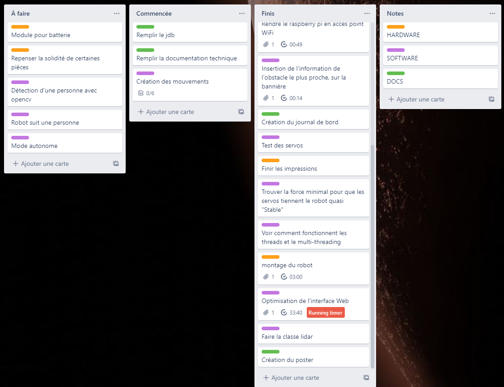

## Librairies et outils externes

### Python Flask {width="100", align="right"}

Flask est un framework web, qui permet de rédiger les applications web avec du Python. Flask a été créé par Armin Ronacher, membre de Pocoo, un groupe de développeurs Python formé en 2004 - le 1 avril 2010. Pour cette application a utilisé Python 3.8.10.

#### Utilisation

Créez un fichier app.py et insérez ce code:

```python
# save this as app.py
from flask import Flask

app = Flask(__name__)

@app.route("/")
def hello():
    return "Hello, World!"
```
Ensuite, dans un terminal de commande lancez "flask run", ce qui vous répondra avec l'adresse de votre site.

```bash
$ flask run
  * Running on http://127.0.0.1:5000/ (Press CTRL+C to quit)
```

### Turbo Flask

Turbo_flask est une extension Flask qui intègre la bibliothèque JavaScript turbo.js à l'application Flask. L'application utilise majoritairement la fonction push qui actualise juste la partie souhaité de la page.

### OpenCV {width="100", align="right"}

OpenCV (Open Source Computer Vision Library : http://opencv.org) est une bibliothèque open-source qui comprend plusieurs centaines d'algorithmes de vision par ordinateur.

### Matplotlib 
{width="150", align="right"}
Matplotlib est une bibliothèque Python qui permet de tracer des graphiques. Elle est utilisée pour la visualisation de données et le traçage de graphiques.

### NumPy {width="100", align="right"}

NumPy est une bibliothèque pour langage de programmation Python, destinée à manipuler des matrices ou tableaux multidimensionnels ainsi que des fonctions mathématiques opérant sur ces tableaux.

### Simple PID

Simple PID est une librairie destinée à aider afin de faire facilement et rapidement des PID.

#### Utilisation

```python
from simple_pid import PID
pid = PID(1, 0.1, 0.05, setpoint=1)

# Assume we have a system we want to control in controlled_system
v = controlled_system.update(0)

while True:
    # Compute new output from the PID according to the systems current value
    control = pid(v)

    # Feed the PID output to the system and get its current value
    v = controlled_system.update(control)
```

### Raspberry Pi 
{width="100", align="right"}
Le Raspberry Pi est un nano-ordinateur monocarte à processeur ARM de la taille d'une carte de crédit conçu par des professeurs du département informatique de l'université de Cambridge dans le cadre de la fondation Raspberry Pi.

### Servokit adafruit

La librairie "Servokit" d'adafruit, est une librairie qui permet de contrôler les servomoteurs du robot grâce au module PCA9685.

#### Utilisation

```python
import time
from adafruit_servokit import ServoKit

# Set channels to the number of servo channels on your kit.
# 8 for FeatherWing, 16 for Shield/HAT/Bonnet.
kit = ServoKit(channels=8)

kit.servo[0].angle = 180
kit.continuous_servo[1].throttle = 1
time.sleep(1)
kit.continuous_servo[1].throttle = -1
time.sleep(1)
kit.servo[0].angle = 0
kit.continuous_servo[1].throttle = 0
```

### Servomoteurs Parallax 
{width="100", align="right"}

{width="300"}

Un servomoteur est un moteur capable de maintenir une opposition à un effort statique et dont la position est vérifiée en continu et corrigée en fonction de la mesure.

### RPLidar 

{width="500"}

La télédétection par laser ou lidar, est une technique de mesures à distance fondée sur l'analyse des propriétés d'un faisceau de lumières renvoyé vers son émetteur.

### adafruit_rplidar {width="200", align="right"}

Adafruit_rplidar est une librairie faite par adafruit qui permet de communiquer avec le lidar, et ainsi permet l'acquisition des données, puis le contrôle du lidar.

#### Utilisation

```python
import os
from math import cos, sin, pi, floor
import pygame
from adafruit_circuitpython_rplidar import RPLidar

# Set up pygame and the display
os.putenv('SDL_FBDEV', '/dev/fb1')
pygame.init()
lcd = pygame.display.set_mode((320,240))
pygame.mouse.set_visible(False)
lcd.fill((0,0,0))
pygame.display.update()

# Setup the RPLidar
PORT_NAME = '/dev/ttyUSB0'
lidar = RPLidar(None, PORT_NAME)

# used to scale data to fit on the screen
max_distance = 0

def process_data(data):
    # Do something useful with the data
    pass

scan_data = [0]*360

try:
    print(lidar.get_info())
    for scan in lidar.iter_scans():
        for (_, angle, distance) in scan:
            scan_data[min([359, floor(angle)])] = distance
        process_data(scan_data)

except KeyboardInterrupt:
    print('Stoping.')
lidar.stop()
lidar.disconnect()
```

### PCA9685

{width="400"}

Ce module est un contrôleur de Servomoteurs PWM à 16 Canaux.

### MPU6050

{width="400"}

Ce module est un système micro-électromécanique (MEMS), il se compose d'un accéléromètre à trois axes et d'un gyroscope à trois axes.

### CR10-S pro v2
{width="100", align="right"}

{width="500"}

Imprimante 3D permettant d'imprimer les pièces du robot.

### Git {width="100", align="right"}

Git est un logiciel de gestion de version qui a été utilisé durant la réalisation du projet afin d'avoir un historique du projet. Le code source est disponible [ici](https://github.com/NickVanMarkes).

### Trello 
{width="100", align="right"}
Trello est un outil de gestion de projet en ligne. Inspiré par la méthode Kanban de Toyota. Il repose sur une organisation des projets en planches listant des cartes, chacune représentant des tâches.

{width="500"}