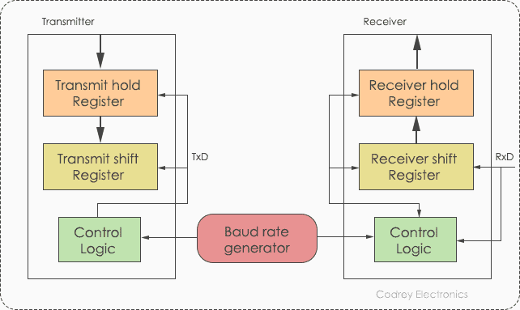
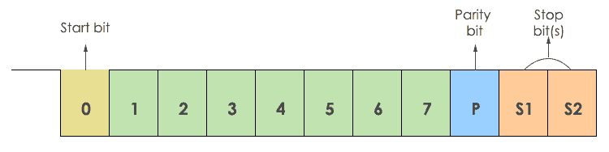
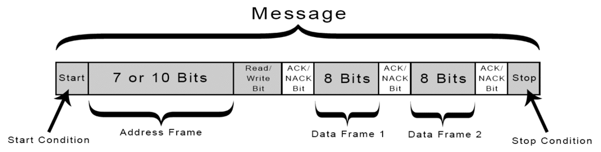
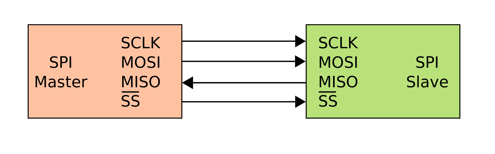
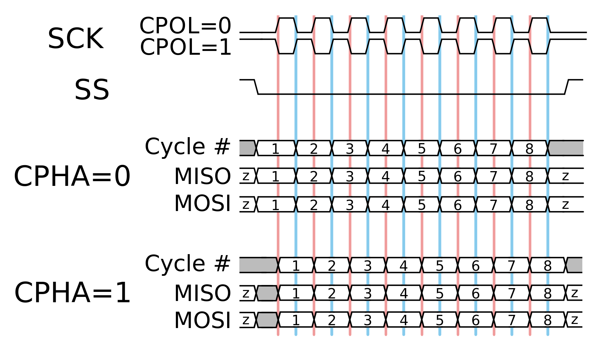
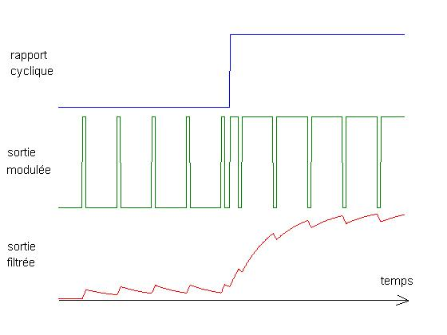

# Les protocoles

## UART
L’UART (Universal Asynchronous Receiver-Transmitter) qui pour résumer est un protocole de communication composé d’un émetteur et d’un récepteur. L’émetteur se constitue d’un registre de maintien d’émission, registre à décalage d’émission et de la logique de contrôle. Pour le récepteur, c’est la même chose sauf qu’être pour émission, c’est de réception. En commun, l’émetteur et le récepteur sont dotés d’un générateur de vitesse de transmission.

{width="700"}

 Le raspberry pi lui envois une trame de données avec 7 bits d’information, qui est compris par le lidar, et fait une action précise. La trame doit le fait de mettre un bit de début et ceux de fin de communication, car s’il en manque un des deux, soit l’information n’a jamais été écoutée, soit le périphérique est en continu entrain d’écouter.

{width="700"}

## I2C

L’I2C (Inter-Integrated Circuit), c’est un protocole de communication qui sert beaucoup, si nous avons beaucoup de modules, car nous pouvons chaîner les modules. Ce protocole utilise des adresses afin de s’adresser aux modules, par exemple le gyroscope est l’adresse 0x68, puis nous lui envoyons en data le registre qui dit au module ce qu’il doit faire. Puis, le module nous renvoie une réponse, par exemple avec le gyroscope il nous renvoie les angles. 

{width="700"}

## SPI
La communication SPI (Serial Peripheral Interface) est un protocole de communication Master/Slave. Master étant le raspberry pi et le Slave étant le lidar.
{width="700"}

 Le raspberry pi lui envois une trame de données avec un registre, qui est compris par le lidar, et fait une action précise. La trame doit respecter le clock(horloge) qu’envois le raspberry pi, car sinon des bits vont se perdre et le message est incomplet.
{width="700"}

## PWM

Le PWM (Pulse With Modulation) est une technique couramment utilisée pour synthétiser des signaux pseudoanalogiques à l’aide de circuits numériques.

