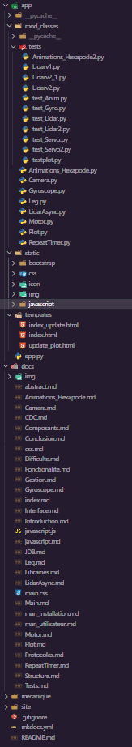

# Structure du projet

Du fait que le projet est réalisé grâce à la librairie <a href="../Librairies">Flask</a>

Voici la structure pour ce projet:

{width="150", align="right"}

* **app/** Ce dossier contient le code de l'application

* **app/mod_classes/** Ce dossier contient les classes du projet

* **app/mod_classes/tests** Ce dossier contient les scripts de test

* **app/static** Ce dossier contient tous les éléments qui ne seront pas modifiés

* **app/static/bootstrap** Ce dossier contient tout ce qui est en rapport avec bootstrap sur les vues

* **app/static/css** Ce dossier contient le css du site

* **app/static/icon** Ce dossier contient l'icône du site

* **app/static/img** Ce dossier contient les images utilisées sur le site

* **app/templates** Ce dossier contient les vues du site, puis le morceau d'html avec lequel on rafraîchit le site

* **docs/** Ce dossier contient la documentation du projet. À la racine, il y a le journal de bord, la documentation technique, ainsi que le cahier des charges

* **docs/img** Ce dossier contient les images utilisées pour la documentation, ou pour le cahier des charges.

* **docs/bootstrap_templates/** Ce dossier contient les maquettes du site généré par Bootstrap studio.