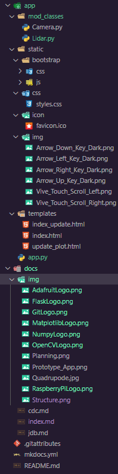

# Documentation technique

## Introduction

Le but de ce projet est de créer un robot capable de se déplacer autonome, ainsi que contrôlé par quelqu'un.

### Organisation

### Livrables

- La documentation technique
- Le journal de bord
- L'accès au git

### Matériels et logiciels nécessaires

- Ordinateur avec Windows 10
- WSL2 avec Ubuntu 20.04.3 LTS
- Visual Studio Code >= 1.63

### Description du projet

Ce robot de type hexapode aura comme fonctionalitées de :

- Pouvoir se déplacer sur le sol (pente ou pas).
- Monter/Descendre des escaliers.
- Détecter toute sorte d'obstacles autour de lui.
- Pouvoir être autonome
- Pouvoir être contrôlé par un téléphone ou ordinateur grâce à une WebApp.

## Gestion du projet

## Plannification

### Planning prévisionnel

### Planning effectif

## Généralité concernant l'implémentation

### Structure

Voici la structure pour ce projet:

{width="150", align="right"}

* **app/** Ce dossier contient le code de l'application

* **app/mod_classes/** Ce dossier contient les classes du projet

* **app/static** Ce dossier contient tous les éléments qui ne seront pas modifiés

* **app/static/bootstrap** Ce dossier contient tout ce qui est en rapport avec bootstrap sur les vues

* **app/static/css** Ce dossier contient le css du site

* **app/static/icon** Ce dossier contient l'icône du site

* **app/static/img** Ce dossier contient les images utilisées sur le site

* **app/templates** Ce dossier contient les vues du site, puis le morceau d'html avec lequel on rafraîchit le site

* **docs/** Ce dossier contient la documentation du projet. À la racine, il y a le journal de bord, la documentation technique, ainsi que le cahier des charges

* **docs/img** Ce dossier contient les images utilisées pour la documentation, ou pour le cahier des charges.

* **docs/bootstrap_templates/** Ce dossier contient les maquettes du site généré par Bootstrap studio.
## Librairies et outils externes

### Python Flask {width="100", align="right"}

Flask est un framework web, qui permet de rédiger les applications web avec du Python. Flask a été créé par Armin Ronacher, membre de Pocoo, un groupe de développeurs Python formé en 2004 - le 1 avril 2010. Pour cette application a utilisé Python 3.8.10.

### Turbo Flask

Turbo_flask est une extension Flask qui intègre la bibliothèque JavaScript turbo.js à l'application Flask. L'application utilise majoritairement la fonction push qui actualise juste la partie souhaité de la page.

### OpenCV {width="100", align="right"}

OpenCV (Open Source Computer Vision Library : http://opencv.org) est une bibliothèque open-source qui comprend plusieurs centaines d'algorithmes de vision par ordinateur.

### Matplotlib 
{width="150", align="right"}
Matplotlib est une bibliothèque Python qui permet de tracer des graphiques. Elle est utilisée pour la visualisation de données et le traçage de graphiques.

### NumPy {width="100", align="right"}

NumPy est une bibliothèque pour langage de programmation Python, destinée à manipuler des matrices ou tableaux multidimensionnels ainsi que des fonctions mathématiques opérant sur ces tableaux.

### Raspberry Pi 
{width="100", align="right"}
Le Raspberry Pi est un nano-ordinateur monocarte à processeur ARM de la taille d'une carte de crédit conçu par des professeurs du département informatique de l'université de Cambridge dans le cadre de la fondation Raspberry Pi.

### Servokit adafruit

La librairie "Servokit" d'adafruit, est une librairie qui permet de contrôler les servomoteurs du robot grâce au module PCA9685.

### Servomoteurs Parallax

Un servomoteur est un moteur capable de maintenir une opposition à un effort statique et dont la position est vérifiée en continu et corrigée en fonction de la mesure.

### RPLidar 

La télédétection par laser ou lidar, est une technique de mesures à distance fondée sur l'analyse des propriétés d'un faisceau de lumières renvoyé vers son émetteur.

### adafruit_rplidar {width="200", align="right"}

Adafruit_rplidar est une librairie faite par adafruit qui permet de communiquer avec le lidar, et ainsi permet l'acquisition des données, puis le contrôle du lidar.

### PCA9685

Ce module est un contrôleur de Servomoteurs PWM à 16 Canaux.

### MPU6050

Ce module est un système micro-électromécanique (MEMS), il se compose d'un accéléromètre à trois axes et d'un gyroscope à trois axes.

### CR10-S pro v2

Imprimante 3D permettant d'imprimer les pièces du robot.

### Git

Git est un logiciel de gestion de version qui a été utilisé durant la réalisation du projet afin d'avoir un historique du projet. Le code source est disponible [ici](https://github.com/NickVanMarkes).

## Analyse des fonctionnalités majeures

## Plan de test et tests

### Périmètres des tests

### Environnement

### Scénarios

### Suivis journalier des tests

## Conclusion

### Difficultés rencontrés

### Améliorations possibles

### Bilan personnel