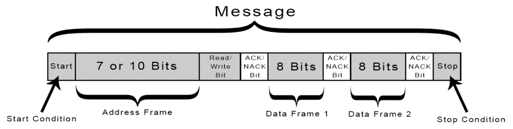
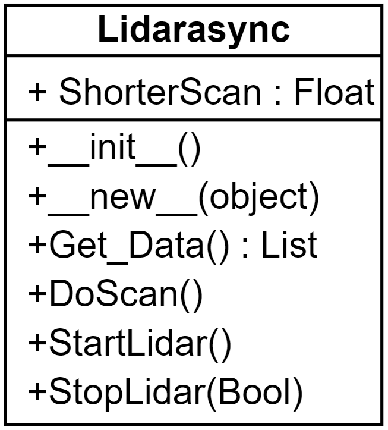
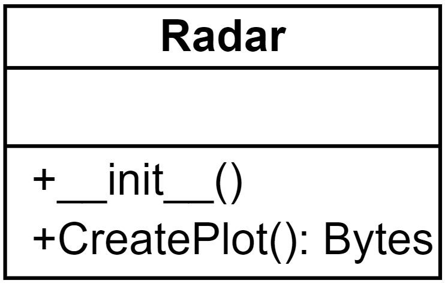
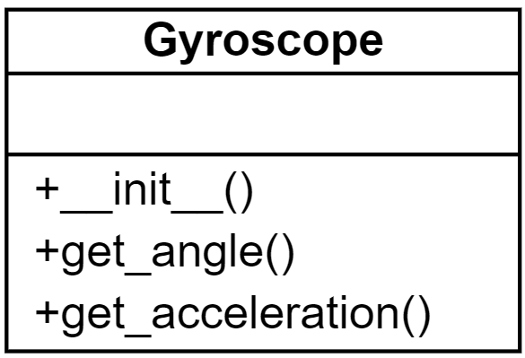
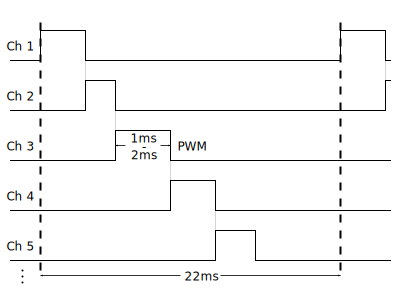
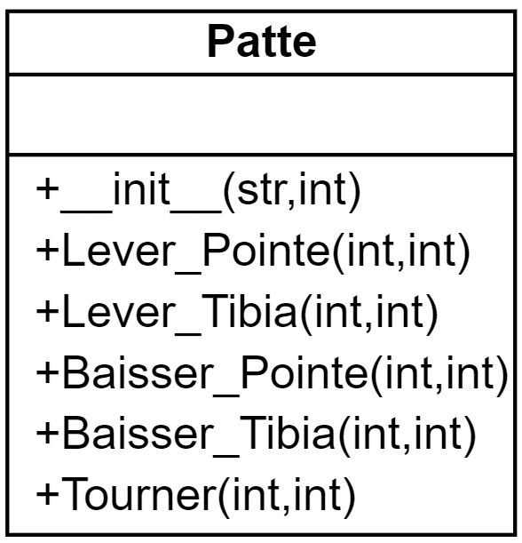

# Documentation technique

## Introduction

Le but de ce projet est de créer un robot capable de se déplacer autonome, ainsi que contrôlé par quelqu'un.

### Organisation

### Livrables

- La documentation technique
- Le journal de bord
- L'accès au git

### Matériels et logiciels nécessaires

- Ordinateur avec Windows 10
- WSL2 avec Ubuntu 20.04.3 LTS
- Visual Studio Code >= 1.63

### Description du projet

Ce robot de type hexapode aura comme fonctionalitées de :

- Pouvoir se déplacer sur le sol (pente ou pas).
- Monter/Descendre des escaliers.
- Détecter toute sorte d'obstacles autour de lui.
- Pouvoir être autonome
- Pouvoir être contrôlé par un téléphone ou ordinateur grâce à une WebApp.

## Gestion du projet

## Plannification

### Planning prévisionnel

,Height="1000"}}

### Planning effectif

## Généralité concernant l'implémentation

### Structure

Voici la structure pour ce projet:

{width="150", align="right"}

* **app/** Ce dossier contient le code de l'application

* **app/mod_classes/** Ce dossier contient les classes du projet

* **app/static** Ce dossier contient tous les éléments qui ne seront pas modifiés

* **app/static/bootstrap** Ce dossier contient tout ce qui est en rapport avec bootstrap sur les vues

* **app/static/css** Ce dossier contient le css du site

* **app/static/icon** Ce dossier contient l'icône du site

* **app/static/img** Ce dossier contient les images utilisées sur le site

* **app/templates** Ce dossier contient les vues du site, puis le morceau d'html avec lequel on rafraîchit le site

* **docs/** Ce dossier contient la documentation du projet. À la racine, il y a le journal de bord, la documentation technique, ainsi que le cahier des charges

* **docs/img** Ce dossier contient les images utilisées pour la documentation, ou pour le cahier des charges.

* **docs/bootstrap_templates/** Ce dossier contient les maquettes du site généré par Bootstrap studio.

## Librairies et outils externes

### Python Flask {width="100", align="right"}

Flask est un framework web, qui permet de rédiger les applications web avec du Python. Flask a été créé par Armin Ronacher, membre de Pocoo, un groupe de développeurs Python formé en 2004 - le 1 avril 2010. Pour cette application a utilisé Python 3.8.10.

#### Utilisation

Créez un fichier app.py et insérez ce code:

```python
# save this as app.py
from flask import Flask

app = Flask(__name__)

@app.route("/")
def hello():
    return "Hello, World!"
```
Ensuite, dans un terminal de commande lancez "flask run", ce qui vous répondra avec l'adresse de votre site.

```bash
$ flask run
  * Running on http://127.0.0.1:5000/ (Press CTRL+C to quit)
```

### Turbo Flask

Turbo_flask est une extension Flask qui intègre la bibliothèque JavaScript turbo.js à l'application Flask. L'application utilise majoritairement la fonction push qui actualise juste la partie souhaité de la page.

### OpenCV {width="100", align="right"}

OpenCV (Open Source Computer Vision Library : http://opencv.org) est une bibliothèque open-source qui comprend plusieurs centaines d'algorithmes de vision par ordinateur.

### Matplotlib 
{width="150", align="right"}
Matplotlib est une bibliothèque Python qui permet de tracer des graphiques. Elle est utilisée pour la visualisation de données et le traçage de graphiques.

### NumPy {width="100", align="right"}

NumPy est une bibliothèque pour langage de programmation Python, destinée à manipuler des matrices ou tableaux multidimensionnels ainsi que des fonctions mathématiques opérant sur ces tableaux.

### Simple PID

Simple PID est une librairie destinée à aider afin de faire facilement et rapidement des PID.

### Raspberry Pi 
{width="100", align="right"}
Le Raspberry Pi est un nano-ordinateur monocarte à processeur ARM de la taille d'une carte de crédit conçu par des professeurs du département informatique de l'université de Cambridge dans le cadre de la fondation Raspberry Pi.

### Servokit adafruit

La librairie "Servokit" d'adafruit, est une librairie qui permet de contrôler les servomoteurs du robot grâce au module PCA9685.

### Servomoteurs Parallax 
{width="100", align="right"}
Un servomoteur est un moteur capable de maintenir une opposition à un effort statique et dont la position est vérifiée en continu et corrigée en fonction de la mesure.

### RPLidar 

La télédétection par laser ou lidar, est une technique de mesures à distance fondée sur l'analyse des propriétés d'un faisceau de lumières renvoyé vers son émetteur.

### adafruit_rplidar {width="200", align="right"}

Adafruit_rplidar est une librairie faite par adafruit qui permet de communiquer avec le lidar, et ainsi permet l'acquisition des données, puis le contrôle du lidar.

### PCA9685

Ce module est un contrôleur de Servomoteurs PWM à 16 Canaux.

### MPU6050

Ce module est un système micro-électromécanique (MEMS), il se compose d'un accéléromètre à trois axes et d'un gyroscope à trois axes.

### CR10-S pro v2
{width="100", align="right"}
Imprimante 3D permettant d'imprimer les pièces du robot.

### Git {width="100", align="right"}

Git est un logiciel de gestion de version qui a été utilisé durant la réalisation du projet afin d'avoir un historique du projet. Le code source est disponible [ici](https://github.com/NickVanMarkes).

### Trello 
{width="100", align="right"}
Trello est un outil de gestion de projet en ligne. Inspiré par la méthode Kanban de Toyota. Il repose sur une organisation des projets en planches listant des cartes, chacune représentant des tâches.

## Analyse des fonctionnalités majeures

Voici un schema qui représente la communication entre les compososants hardware et leur protocols de communication.


### Les différents protocoles

#### UART
L'UART (Universal Asynchronous Receiver-Transmitter) qui pour résumer est un protocol de communication composé d'un émetteur et d'un récepteur. L'émetteur se compose d'un registre de maintien d'émission, registre à décalage d'émission et de la logique de contrôle. Pour le récepteur c'est la même chose sauf qu'être pour émission c'est de réception. En commum, l'émetteur et le récepteur sont dotés d'un générateur de vitesse de transmission.

{width="700"}

 Le raspberry pi lui envois une trame de données avec 7 bits d'information, qui est compris par le lidar, et fait une action précise. la trame doit le fait de mettre un bit de début et ceux de fin de communication, car s'il en manque un des deux, soit l'information n'as jamais été écoutée, soit le périphérique est en continu entrain d'écouter.

{width="700"}

#### I2C

L'I2C (Inter-Integrated Circuit), c'est un protocol de communication qui sert beaucoup, si nous avons beaucoup de modules, car nous pouvons chaîner les modules. Ce protocole utilise des adresses afin de s'adresser aux modules, par example le gyroscope est l'adresse 0x68, puis nous lui envoyons en data le registre qui dit au module ce qu'il doit faire. Puis, le module nous renvois une réponse, par exemple avec le gyroscope il nous renvois les angles. 

{width="700"}

#### PWM

Le PWM (Pulse With Modulation) est une technique couramment utilisée pour synthétiser des signaux pseudo analogiques à l'aide de circuits numériques.


### Classe Lidar
Pour commencer, je vais vous expliquer ce qu'est un lidar. D'abord, un lidar c'est un appareil qui a un laser et un capteur optique monté sur un moteur, et quand il tourne, il détecte les obstacles grâce au temps que prends le laser à être détécter par le capteur optique. La communication avec le lidar est de l'UART. comme expliqué sur l'image ci-dessous.


Et pour le projet j'ai placé le lidar sur le haut du robot, car si je le mettais en dessous j'allais toujours détécter les pattes ce qui nous enlèverais beaucoup trop de vision. Le lidar tourne en continue car, ainsi les informations prennent moins de temps à être prises.

Ensuite, pour la programmation de cette classe, à l'initialisation du script "app.py" je lance le moteur du lidar, puis, de manière asynchrone, j'envoie les informations reçues du lidar dans une liste, ce qui les actualise régulièrement. Pour l'acquisition des données, il faut prendre toujours 2 tours du lidar, car au premier tour le lidar nous envois depuis sa position actuelle jusqu'à ~360°, donc si on veut avoir un tour complet sûr, nous avons qu'à enregistrer le tour complet d'après, c'est pour ça que je fais 2 tours. Puis dès qu'une classe en a besoin, elle appelle la fonction "Get_Data()" qui lui envois une liste des dernières valeurs recueillies.

{width="300"}

Comme vous pouvez le voir ci-dessus, cette classe est faite d'une propriété (ShorterScan), et de 4 fonctions. Je vais détailler ci-dessous ce que font ces éléments.

#### ShorterScan : Float

ShorterScan est une propriété qui sert à ce qu'il y aie toujours la distance la plus proche entre le robot et un obstacle de disponible. Elle se met à jour dans la fonction "DoScan".

#### \__init__()


Ceci est le constructeur de ma classe Lidar. Il initialise les valeurs, puis instantie un lidar.

#### \__new__()


Cette fonction est utile, pour rendre les classes en singleton, afin de ne pas avoir d'autres instances du lidar dans le programme.

#### Get_Data() : List

Dans cette fonction, je vérifie que la liste avec les données ne soit pas vide et s'il n'est pas vide je renvoie les valeurs, sinon un tableau vide.

#### DoScan()

Au début de la fonction, j'initialise les valeurs et reconnecte le lidar. Ensuite, je lance un scan grâce à la fonction du module RPLidar "iter_scans", et j'entre les valeurs dans une liste vide, qui se remplis petit à petit. Puis dans ces valeurs là, je les trie et j'actualise la plus petite distance. Et finalement, quand il y a deux scans, j'arrête l'acquisition des données.

#### StartLidar()

Cette fonction me sert à lancer le moteur au début du programme principal.

#### StopLidar(Bool)


Cette fonction me sert à arrêter le lidar, dès que les données sont récoltées, et avec le paramètre je peux aussi arrêter le moteur, afin de faire un arrêt complet du lidar.


### Classe VideoCamera

Pour cette classe, j'utilise la librairie OpenCV. Cette classe me permet de récupérer les données de la caméra.

{width="300"}

#### \__init__()

Ceci est le constructeur de la classe VideoCamera, il instancie la caméra grâce à openCV.

#### \__del__()

Cette fonction sert à libérer la caméra.

#### get_frame() : bytes

Cette fonction capture le flux vidéo de caméra, la convertie en bytes et retourne celui-ci.

### Classe Radar

Cette classe sert à créer la vue radar. Elle m'est utile pour créer une image avec les points que la classe lidar détecte et je l'actualise afin d'avoir un retour un minimum fluide. À l'initialisation, la classe dessine l'arrière-plan de l'image, ce qui veut les le fond blanc, les lignes pour les distances ainsi que mettre les chiffres pour que l'utilisateur sache de qu'elle distance il s'agit.

Ensuite, j'actualise seulement les points dans le but d'essayer de ne pas prendre trop de temps inutilement en redessinant des éléments futiles, et/ou permanent.

Voici un exemple de la vue que l'utilisateur voit :


{width="300"}

#### \__init()

Cette fonction est le constructeur de cette classe. Elle me permet d'instancier matplotlib, puis initialiser les valeurs qui ne changent pas.

#### CreatePlot(): Figure

Cette classe me permet de remettre à jour la vue radar. Puis, j'envois la nouvelle figure à la classe principale qui l'affiche sur le site web.

### Classe Gyroscope

Pour le gyroscope, j'utilise un module MPU-6050 qui dessus à un gyroscope ainsi qu'un acceleromètre. Ce composant est improprement nommé gyroscope, car ce n'est pas un "vrai" gyroscope avec les anneaux, mais c'est un MEMS (MicroElectroMechanical Systems). Le fonctionnement de ce MEMS est qu'avec des mécanismes micrométriques réalisés sur silicium, elles sont mis en mouvement grâce aux forces générées par des transducteurs électromécaniques (dispositif servant de convertir un signal physique en un autre), et ce dernier fait l'interface entre la mécanique et l'électrique, et un circuit récupère ce signal et le transforme en signal numérique.

Ce module comminunique en I2C. Son adresse est 0x68, dépendemment du registre, il nous rends les angles, ou l'acceleration.

Afin d'utiliser correctement ce module, j'ai utilisé la librairie fait par le fabriquant. Ce qui gère pour nous la communication entre le gyroscope et le raspberry pi. Ce qui rends les fonctions plus courtes et simples.

{width="300"}

#### \__init__()

Cette fonction est le constructeur de la classe. Elle me permet instancier le capteur, ainsi qu'initialiser certaines valeurs.

#### get_angle(): dict[str, float]

Cette classe permet récupérer l'inclinaison du robot grâce au gyroscope.

#### get_acceleration(): dict[str, float]

Cette classe permet de récupérer les valeurs de l'acceleromètre.

### Classe ServoMoteur

Explication des servomoteurs,

Pour commencer, afin de bien comprendre de ce qu'on parle, je vais vous expliquer ce qu'est un servomoteur.
Un servomoteur est un moteur à courant continu de petite taille, avec un réducteur à la sortie, afin de diminuer la vitesse, tout en augmentant le couple. Puis, dans les servo standard il y a un potentiomètre afin de contrôlé la position, mais dans les parallax 900-00008 il n'y a pas car ce sont des servomoteurs, à rotation continu.


De ce fait, avec les servomoteurs standard on n'as qu'a mettre un angle, puis il y reste, alors que les notres, il faut le dire dans quel sense tourner, la force à avoir, et quand l'arrêter.
La communication avec le servomoteur ce fait grâce au PWM, il faut lui envoyer une impulsion entre 1.3 [ms] et 1.890 [ms], 1.500 [ms] étant le milieu, en dessous ça fait tourner dans un sens, au dessus dans un autre sens.

{align="center"}

Afin d'avoir une meilleure compréhension dans mes mouvements, j'ai fait une classe qui contrôle les servomoteurs.

Voici le diagramme de classe :

{width=300}


#### \__init__(string, int)

Ceci est le constructeur de la classe qui initialise le servomoteur, sur le bon module PCA et à la bonne Pin.

Channel = "Gauche"/"Droite"

Position = 0 à 15

#### SetAngleRel(int, int)

Cette fonction permet de définir l'angle du servomoteur avec une force donnée.
La force est entrée en pourcent.

Angle = -180 à 180

Force = 1 à 100

#### StayWithForce(string)

Cette fonction permet de garder le servomoteur avec une légère force, grâce au paramètre nous pouvons décider dans quel sens.

#### WithoutForce()

Cette fonction mets le servomoteur sans force.

### Classe Patte

Cette classe me sert à faire les mouvements des parties des pattes plus simplement. Les fonctions font des actions précises et que le nécéssaire afin de créer des mouvements.

Voici le diagramme de la classe :

{width=300}


#### \__init__ (string, string)

Ceci est le constructeur de cette classe. J'initialise les servomoteurs, de la patte selon le branchement hardware.

Le branchement à été fait en sorte que chaque groupe de 3 servomoteurs par patte soit facilement retrouvable.

Pour l'avant gauche:

 - La pointe: Pin 2
 - Le tibia: Pin 1
 - La Hanche: Pin 0

Pour le milieu gauche:

 - La pointe: Pin 4 
 - Le tibia: Pin 5
 - La Hanche: Pin 6

Pour l'arrière gauche:

 - La pointe: Pin 15
 - Le tibia: Pin 13
 - La Hanche: Pin 12

Pour l'avant droite:

 - La pointe: Pin 15
 - Le tibia: Pin 14
 - La Hanche: Pin 13

Pour le milieu droite:

 - La pointe: Pin 44
 - Le tibia: Pin 5
 - La Hanche: Pin 6

Pour l'arrière droite:

 - La pointe: Pin 0
 - Le tibia: Pin 1
 - La Hanche: Pin 2

#### Lever_Pointe (int, int)

Cette classe permet de lever la pointe de la patte à un angle préçis et à la force donnée.

#### Lever_Tibia (int, int)

Cette classe permet de lever le tibia de la patte à un angle préçis et à la force donnée.

#### Baisser_Pointe (int, int)

Cette classe permet de Baisser la pointe de la patte à un angle préçis et à la force donnée.

#### Baiser_Tibia (int, int)

Cette classe permet de baisser le tibia de la patte à un angle préçis et à la force donnée.

#### Tourner (int, int)

Cette classe permet de tourner la patte à un angle préçis et à la force donnée.

## Plan de test et tests

### Périmètres des tests

### Environnement

### Scénarios

### Suivis journalier des tests

## Conclusion

### Difficultés rencontrés

#### Vue Radar

    Temps d'acquisition, création du plot, téléchargement sur le site.

#### Lidar
    Erreur dans le descriptor, trop de données enregistrées, compréhension de l'asynchrone, réalisation de l'asynchrone, Timer qui ne signifie pas ce que je pensais, création d'un Timer qui se répète.

#### Mouvements

    Synchronisation des servos, force des servos,

### Améliorations possibles

### Bilan personnel