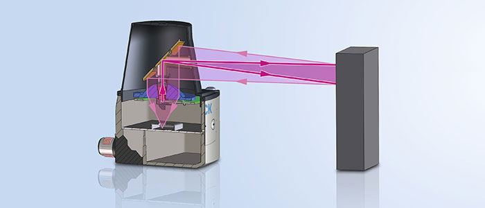

# Documentation technique

## Introduction

Le but de ce projet est de créer un robot capable de se déplacer autonome, ainsi que contrôlé par quelqu'un.

### Organisation

### Livrables

- La documentation technique
- Le journal de bord
- L'accès au git

### Matériels et logiciels nécessaires

- Ordinateur avec Windows 10
- WSL2 avec Ubuntu 20.04.3 LTS
- Visual Studio Code >= 1.63

### Description du projet

Ce robot de type hexapode aura comme fonctionalitées de :

- Pouvoir se déplacer sur le sol (pente ou pas).
- Monter/Descendre des escaliers.
- Détecter toute sorte d'obstacles autour de lui.
- Pouvoir être autonome
- Pouvoir être contrôlé par un téléphone ou ordinateur grâce à une WebApp.

## Gestion du projet

## Plannification

### Planning prévisionnel

### Planning effectif

## Généralité concernant l'implémentation

### Structure

Voici la structure pour ce projet:

{width="150", align="right"}

* **app/** Ce dossier contient le code de l'application

* **app/mod_classes/** Ce dossier contient les classes du projet

* **app/static** Ce dossier contient tous les éléments qui ne seront pas modifiés

* **app/static/bootstrap** Ce dossier contient tout ce qui est en rapport avec bootstrap sur les vues

* **app/static/css** Ce dossier contient le css du site

* **app/static/icon** Ce dossier contient l'icône du site

* **app/static/img** Ce dossier contient les images utilisées sur le site

* **app/templates** Ce dossier contient les vues du site, puis le morceau d'html avec lequel on rafraîchit le site

* **docs/** Ce dossier contient la documentation du projet. À la racine, il y a le journal de bord, la documentation technique, ainsi que le cahier des charges

* **docs/img** Ce dossier contient les images utilisées pour la documentation, ou pour le cahier des charges.

* **docs/bootstrap_templates/** Ce dossier contient les maquettes du site généré par Bootstrap studio.
## Librairies et outils externes

### Python Flask {width="100", align="right"}

Flask est un framework web, qui permet de rédiger les applications web avec du Python. Flask a été créé par Armin Ronacher, membre de Pocoo, un groupe de développeurs Python formé en 2004 - le 1 avril 2010. Pour cette application a utilisé Python 3.8.10.

### Turbo Flask

Turbo_flask est une extension Flask qui intègre la bibliothèque JavaScript turbo.js à l'application Flask. L'application utilise majoritairement la fonction push qui actualise juste la partie souhaité de la page.

### OpenCV {width="100", align="right"}

OpenCV (Open Source Computer Vision Library : http://opencv.org) est une bibliothèque open-source qui comprend plusieurs centaines d'algorithmes de vision par ordinateur.

### Matplotlib 
{width="150", align="right"}
Matplotlib est une bibliothèque Python qui permet de tracer des graphiques. Elle est utilisée pour la visualisation de données et le traçage de graphiques.

### NumPy {width="100", align="right"}

NumPy est une bibliothèque pour langage de programmation Python, destinée à manipuler des matrices ou tableaux multidimensionnels ainsi que des fonctions mathématiques opérant sur ces tableaux.

### Raspberry Pi 
{width="100", align="right"}
Le Raspberry Pi est un nano-ordinateur monocarte à processeur ARM de la taille d'une carte de crédit conçu par des professeurs du département informatique de l'université de Cambridge dans le cadre de la fondation Raspberry Pi.

### Servokit adafruit

La librairie "Servokit" d'adafruit, est une librairie qui permet de contrôler les servomoteurs du robot grâce au module PCA9685.

### Servomoteurs Parallax 
{width="100", align="right"}
Un servomoteur est un moteur capable de maintenir une opposition à un effort statique et dont la position est vérifiée en continu et corrigée en fonction de la mesure.

### RPLidar 

La télédétection par laser ou lidar, est une technique de mesures à distance fondée sur l'analyse des propriétés d'un faisceau de lumières renvoyé vers son émetteur.

### adafruit_rplidar {width="200", align="right"}

Adafruit_rplidar est une librairie faite par adafruit qui permet de communiquer avec le lidar, et ainsi permet l'acquisition des données, puis le contrôle du lidar.

### PCA9685

Ce module est un contrôleur de Servomoteurs PWM à 16 Canaux.

### MPU6050

Ce module est un système micro-électromécanique (MEMS), il se compose d'un accéléromètre à trois axes et d'un gyroscope à trois axes.

### CR10-S pro v2
{width="100", align="right"}
Imprimante 3D permettant d'imprimer les pièces du robot.

### Git {width="100", align="right"}

Git est un logiciel de gestion de version qui a été utilisé durant la réalisation du projet afin d'avoir un historique du projet. Le code source est disponible [ici](https://github.com/NickVanMarkes).

### Trello 
{width="100", align="right"}
Trello est un outil de gestion de projet en ligne. Inspiré par la méthode Kanban de Toyota. Il repose sur une organisation des projets en planches listant des cartes, chacune représentant des tâches.

## Analyse des fonctionnalités majeures

### Classe Lidar
Pour commencer, je vais vous expliquer ce qu'est un lidar. D'abord, un lidar c'est un appareil qui a un laser et un capteur optique monté sur un moteur, et quand il tourne, il détecte les obstacles grâce au temps que prends le laser à être détécter par le capteur optique. comme expliqué sur l'image ci-dessous.

La communication avec le lidar est du SPI (Serial Peripheral Interface) qui pour résumer est un protocol de communication Master/Slave Master étant le raspberry pi et le Slave étant le lidar.

 Le raspberry pi lui envois une trame de données avec un registre, qui est compris par le lidar, et fait une action précise. la trame doit respecter le clock(horloge) qu'envois le raspberry pi, car sinon des bits vont se perdre et le message est incomplet.

Et pour le projet j'ai placé le lidar sur le haut du robot, car si je le mettais en dessous j'allais toujours détécter les pattes ce qui nous enlèverais beaucoup trop de vision. Le lidar tourne en continue car, ainsi les informations prennent moins de temps à être prises.

Ensuite, pour la programmation de cette classe, à l'initialisation du script "app.py" je lance le moteur du lidar, puis, de manière asynchrone j'envois les informations reçues du lidar dans une liste, qui s'actualise donc souvent.Pour l'acquisition des données il faut prendre toujours 2 tours du lidar, car au premier tour le lidar nous envois de sa postion actuelle jusqu'à ~360°, donc si on veut avoir un tour complet sûr, nous avons qu'à enregistrer le tour complet d'après, c'est pour ça que je fait 2 tours. Puis dès qu'une classe en a besoin, elle appelle la fonction "Get_Data()" qui lui envois une liste de toutes les valeurs.

### Classe Plot

Cette classe sert à créer les "Plots", c'est ce que j'appel la vue radar. Elle m'est utile pour créer une image avec les points que la classe lidar détecte et je l'actualise afin d'avoir un retour un minimum fluide. A l'initialisation, la classe déssine le background de l'image, ce qui veut les le fond blanc, les lignes pour les distances ainsi que mettre les chiffres pour que l'utilisateur sache de qu'elle distance il s'agit.

Ensuite, j'actualise seulement les points afin d'essayer de ne pas prendre trop de temps inutilement en redéssinant des éléments futiles, et/ou permanent.

### Classe Gyroscope

Pour le gyroscope, j'utilise un module MPU-6050 qui dessus à un gyroscope ainsi qu'un acceleromètre. Ce composant est improprement nommé gyroscope, car ce n'est pas un "vrai" gyroscope avec les anneaux, mais c'est un MEMS (MicroElectroMechanical Systems). Le fonctionnement de ce MEMS est qu'avec des mécanismes micrométriques réalisés sur silicium, elles sont mis en mouvement grâce aux forces générées par des transducteurs électromécaniques (dispositif servant de convertir un signal physique en un autre), et ce dernier fait l'interface entre la mécanique et l'électrique, et un circuit récupère ce signal et le transforme en signal numérique.

L'utilisation de ce module est assez simple, il communique en I2C, c'est un protocol de communication qui sert beaucoup, si nous avons beaucoup de modules, car nous pouvons chaîner les modules. Ce protocole utilise des adresses afin de s'adresser aux modules, par example le gyroscope est l'adresse 0x68, puis nous lui envoyons en data le registre qui dit au module ce qu'il doit faire (un peu comme le SPI). Puis, le module nous renvois une réponse, par exemple avec le gyroscope il nous renvois les angles. 

Afin d'utiliser correctement ce module, j'ai utilisé la librairie fait par le fabriquant. Ce qui gère pour nous la communication entre le gyroscope et le raspberry pi. Ce qui rends les fonctions plus courtes et simples.

### Classe Patte

Explication des servomoteurs,

Pour commencer, afin de bien comprendre de ce qu'on parle, je vais vous expliquer ce qu'est un servomoteur.
Un servomoteur est un moteur à courant continu de petite taille, avec un réducteur à la sortie, afin de diminuer la vitesse, tout en augmentant le couple. Puis, dans les servo standard il y a un potentiomètre afin de contrôlé la position, mais dans les parallax 900-00008 il n'y a pas car ce sont des servomoteurs, à rotation continu.

De ce fait, avec les servomoteurs standard on n'as qu'a mettre un angle, puis il y reste, alors que les notres, il faut le dire dans quel sense tourner, la force à avoir, et quand l'arrêter.
La communication avec le servomoteur est assez simple, il faut lui envoyer une impulsion entre 1.3 [ms] et 1.890 [ms], 1.500 [ms] étant le milieu, en dessous ça fait tourner dans un sens, au dessus dans un autre sens.

{align="center"}

Explication de la classe dès qu'elle sera fonctionnelle

## Plan de test et tests

### Périmètres des tests

### Environnement

### Scénarios

### Suivis journalier des tests

## Conclusion

### Difficultés rencontrés

#### Vue Radar

### Améliorations possibles

### Bilan personnel