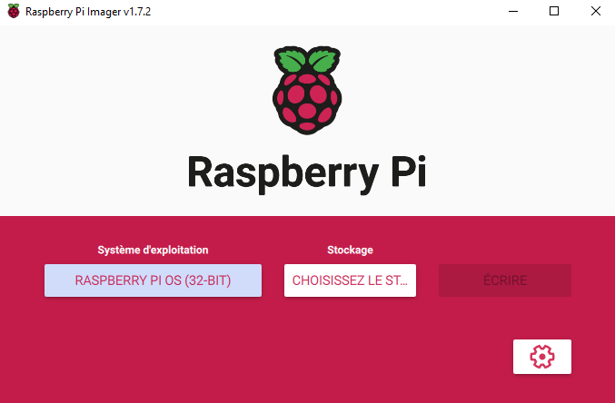
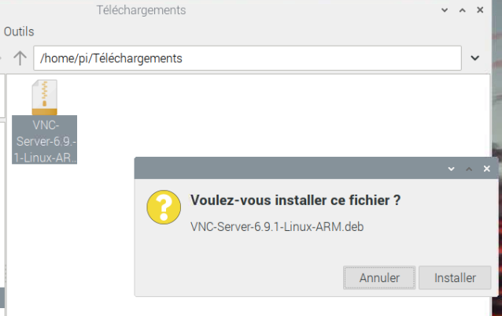
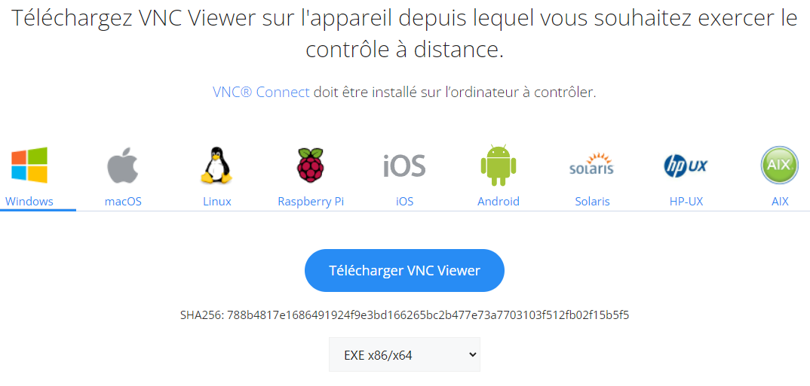
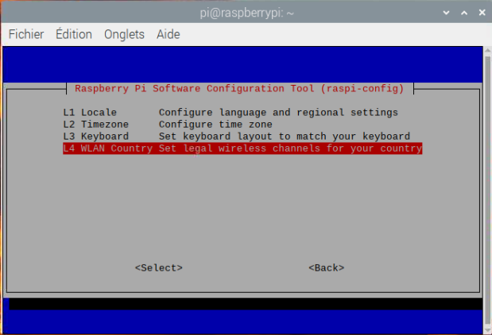
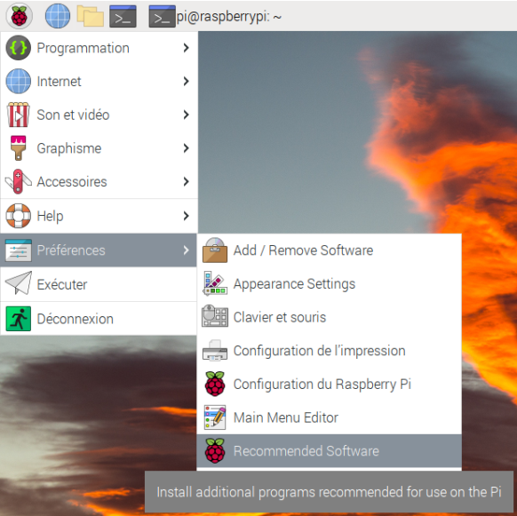
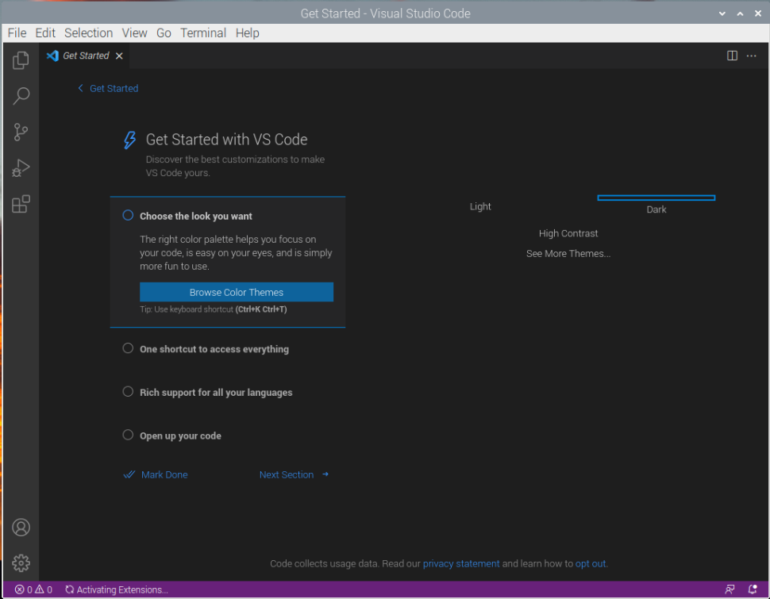

# Manuel d'installation
## Prérequis

Afin que les versions cohensident ainsi que le matériel, vous devez avoir:

- Un poste fonctionnel
- Raspberry pi 3
- Carte SD(16GB minimum) + adaptateur
- Accès à internet

## Téléchargement de l'OS Raspbian 32 bits
### Installation de Raspberry pi Imager

Pour commencer, Téléchargez l'application <a href="https://www.raspberrypi.com/software/">Raspberry pi Imager</a>, cela permettra de mettre l'OS sur la carte SD.

Pour cette étape je l'ai fait sur un poste Windows, de ce fait j'ai juste téléchargé leur installeur. Une fois l'application téléchargée, il faut l'installer.

Faites un double-clic sur l'exécutable téléchargé.

{width=700}

Une fenêtre s'ouvrira en proposant de démarrer l'installation. Cliquez sur le bouton **Install**.

{width=500, align="center"}

L'application s'intallera. Une fois l'installation terminée, le programme vous proposera de démarrer l'application.

Cliquez sur le bouton **Finish**.

{width=500}

### Utilisation de Raspberry Pi Imager

Une fois l'application démarrée, vous devez cliquer sur le bouton **CHOISISSEZ L'OS**

{width=500}

Cela ouvrira une fenêtre vous permettant de choisir l'OS que vous voulez installer sur le raspberry pi.

Pour ma part, j'utilise celui proposé en premier, **Raspberry Pi OS (32-bit)**.

{width=500}

Ensuite, Cela vous ramènera denouveaux sur la page principale, et cliquez sur le bouton du milieu **CHOISISSEZ LE STOCK...**.

{width=500}

Veuillez selectionner le lecteur sur lequel vous voulez installer l'OS. Pour ma part, je ferais l'installation sur **Kingston UHSOO uSD USB Device - 15.9 GB**.

{width=500}

Et Enfin de finir avec cette partie, cliquez sur **ÉCRIRE** afin de démarrer l'installation.

{width=500}

<span style="text-decoration: underline">/!\</span> **Attention** <span style="text-decoration: underline">/!\</span> Vérifiez qu'il n'y ai aucune donnée dans le support où vous allez installer l'OS. Toutes les données les données seront écrasées !

Si vous n'avez rien d'important dedans, alors vous pouvez cliquer sur le bouton **OUI**, sinon cliquez sur le bouton **NON** et prenez le temps de sauvegarder vos données.

{width=500}

Maintenant, vous n'avez plus qu'à attendre la fin de l'installation.

{width=500}

S'il n'y a eu aucune erreur durant l'installation, vous aurez ce message vous indiquant que l'opération est terminée et avec succès.

Vous pouvez aprésent cliquer sur **CONTINUER** et fermer le programme.

{width=500}

## VNC Server

Sur le raspberry pi, téléchargez <a href="https://www.realvnc.com/fr/connect/download/vnc/raspberrypi/">REALVNC</a>.

Pour cela, il vous sufiit de sélectionner **Raspberry Pi** et d'ensuite cliquer sur le bouton **Download VNC Server**.

{width=500}

Une fois le téléchargement terminé, allez dans votre dossier téléchargement et exécuter le fichier d'installation.

Un message est censé apparaître, appuyez sur le bouton **Installer**.

{width=500}

Après une petite attente, une nouvelle fenêtre s'ouvrira, **Authentification**.
Insérez le mot de passe du raspberry pi, par défaut le mot de passe est : *raspberry*

{width=500}

Une fois l'installation teminée, allez sur le menu du raspberry, *Préférences -> Configuration du Raspberry Pi*.

{width=500}

Ensuite, cliquez sur le bouton enface de **VNC**. Cela activera VNC Server et permettra ainsi la connexion au Raspberry via VNC.

Dès que c'est fait, cliquez sur **Valider**.

{width=500}

Une fenêtre vous indiquant qu'il faut redémarrer va apparaître. Cliquez sur le bouton **Yes** afin de
redémarrer. 

{width=500}

Et voilà votre VNC Server est configuré et accessible!

Pour vous connecter sur votre raspberry pi, ouvrez un terminal de commande et tappez :

```bash

ifconfig
```

Appuyez sur *enter*.

Au début de la réponse, il y a l'adresse IP de votre Raspberry. La mienne est *10.5.51.36*.

{width=500}

Connaître l'adresse IP est nécessaire afin de pouvoir se connecter sur la machine qui contrôlera le raspberry pi.

## VNC Viewer
### Installation

Maintenant que le VNC Server est installé et configuré, nous pouvons nous lancer sur l'installation du VNC Viewer.

Pour commencer, allez sur <a href="https://www.realvnc.com/fr/connect/download/viewer/"> REALVNC </a> et lancer le téléchargement.

Choisissez votre système d'exploitation.(Windows personnellement)

Cliquez ensuite sur **Télécharger VNC Viewer**.

{width=500}

Allez sur l'installateur que vous avez télécharger et éxécutez-le.

Une fenêtre d'installation va apparaître, choisissez le langage que vous voulez utiliser. Une fois le choix effectué, appuyer sur **OK** .

{width=500}

Appuyez sur le bouton **Suivant** pour commencer l'installation.

{width=500}

Lisez et acceptez *les termes du contrat de licence* . 

Ensuite, appuyez sur le bouton **Suivant** .

{width=500}

Si vous ne voulez pas modifier l'endroit d'installation, appuyez directement sur **Suivant** .

Sinon modifier l'endroit ou l'installer et appuyer ensuite sur **Suivant** .

{width=500}

Une fois que vous avez terminé la configuration cliquer sur **Installer** . 

Une Fenêtre peut apparaître sur votre écran, appuyer sur le bouton **Oui**.

{width=500}

La fenêtre d'installation devrait apparaître, il ne reste plus qu'à attendre.

{width=500}

Une fois l'installation terminée, si tout c'est bien passé, il ne vous reste plus qu'à appuyer sur **Terminer** .

{width=500}

### Utilisation

Ouvrez VNC Viewer, l'application devrait ressembler à celle que j'ai.

{width=500}

Faites un *clic droit* sur le fond. Le menu contextuel devrait apparaître.

Cliquez ensuite sur **Nouvelle connexion...** .

{width=500}

La fenêtre *Propriétés* devrait s'ouvrir.

Remplissez le premier champ ( **VNC Server** ) avec l'adresse IP du Raspberry vu ci-dessus.

Une fois l'adresse entrée, appuyez sur le bouton **OK** en bas à droite.

{width=500}

Une connexion avec l'adresse IP que vous avez rentré est censée apparaître sur le menu de VNC.

Faites un *double-clic* dessus.

{width=200}

Il faut désormais remplir le *nom d'utilisateur* ainsi que le *mot de passe*.

Par défaut, le nom d'utilisateur est *pi* , et le mot de passe *raspberry* .

Si vous allez vous connecter régulièrement au raspberry je conseille de cocher la case **Mémoriser le mot de passe** . 

Une fois les champs remplis appuyez sur **OK** .

{width=500}

Vous voilà connecté au raspberry pi !

{width=500}

## Raspap

Afin d'installer Raspap sur le raspberry, commencez par être sûr que votre raspberry est à jour.

Si votre raspberry "s'arrête" pendant l'installation des packets, lisez la dernière ligne et appuyez sur enter (utilise la valeur par défaut). 

```bash
sudo apt-get update
sudo apt-get full-upgrade
# !Redémarre le raspberrry!
sudo reboot
```

Une fois le raspberry redémarré, utilisez cette commande pour mettre la bonne localisation de votre raspberry.

```bash
sudo raspi-config
```

Une fenêtre s'ouvrira, avec les flèches directionnelles selectionnez le 5ème point *Localisation Options*.

{width=500}

Ensuite, sélectionnez la dernière option *WLAN Country*.

{width=500}

Veuillez sélectionnez dans le pays auquel vous vous trouvez. (En suisse pour ma part)

{width=500}

Maintenant, cette fenêtre n'est qu'une validation du pays, appuyez sur **Ok**.

{width=500}

Ensuite, acceptez le redémarrage, ainsi les modifications seront comptabilisées. appuyez sur **Oui**.

{width=500}

Dès que le raspberry pi a redémarrer, ouvrez un terminal de commande et lancez cette commande :

```bash
curl -sL https://install.raspap.com | bash
```

De temps en temps la console vous demandera si vous voulez activer certaines fonctionnalités de raspap.

```bash
Installing lighttpd directory: /var/www/html? [Y/n]
```

Par défaut, la valeur est **Y** , et je conseille de la laisser ainsi.

sur toutes les questions appuyez sur **Y**, jusqu'à ce que vous arrivez à ce message :

```bash
The system needs to be rebooted as a final step, reboot now? [Y/n]
```

<span style="text-decoration: underline">/!\</span> **Attention** <span style="text-decoration: underline">/!\</span>

Si vous appuyez sur **Y**, votre raspberry pi redémarrera. Pensez à bien avoir sauvegarder ce que vous faisiez avant de redémarrer.

si tout est sauvegarder, appuyez sur **Y**.

Une fois le raspberry redémarrer, vous pouvez vous connecter avec votre téléphone sur l'access-point que vous venez de créer.

Vous pouvez aussi accéder à la configuration du réseau en allant sur votre navigateur et en entrant l'adresse IP du raspberry ( ifconfig ) Par défaut, les identifiants de connexion sont :

| Nom| Valeur|
|--|--|
|Nom d'utilisateur|admin|
|Mot de passe|secret|

{width=300}

Vous accéderez à cette page. Je vous laisserais ici gérer votre réseau.

{width=500}

## VS Code

Voici comment faire pour avoir l'éditeur VS Code pour raspberry pi.

Allez en premier dans les *Préférences -> Recommended Software*.

{width=500}

La fenêtre **Recommended Software** va s'ouvrir, allez tout en bas de l'ascenseur.

{width=500}

Cochez **Visual Studio Code** pour l'activer.

Une fois que c'est fait, appuyez sur **Apply**.

{width=500}

Normalement, une fois l'installation terminée, l'application devrait apparaître dans le menu *Programmation -> Visual Studio Code*

{width=500}

Au premier démarrage, l'application va vous proposer plusieurs réglages, a vous de les choisir selon vos préférences.

{width=500}

## Librairies nécessaires

Il vous faut encore télécharger et installer diverse librairies nécessaire au bon fonctionnement de l'application.

```bash
# OpenCV, cette installation peut prendre jusqu'à plusieurs heures
pip3 install --upgrade pip
pip3 install -U numpy
pip3 install opencv-contrib-python
# Si il y a des erreurs, installer aussi ces librairies (ça peut corriger la plus grande partie des problèmes)
sudo apt-get install python3-opencv
sudo apt-get install libhdf5-dev
sudo apt-get install libhdf5-serial-dev
sudo apt-get install libatlas-base-dev
sudo apt-get install libjasper-dev
sudo apt-get install libqtgui4
sudo apt-get install libqt4-test

# Flask
pip3 install Flask
# Turbo-Flask
pip3 install Turbo-Flask

# Lidar
pip3 install adafruit-rplidar

# Matplotlib
python -m pip install -U matplotlib

# PID
pip3 install simple-pid

# PCA9685
pip3 install adafruit-circuitpython-pca9685

# MPU6050
pip3 install mpu6050-raspberrypi

# Servomoteur
pip3 install adafruit-circuitpython-motor
```

## Activation des interfaces nécessaires

Pour commencer, accéder à *Préférences -> Configuration du Raspberry Pi*.

{width=500}

|Nom|État|
|----|----|
|SSH|Disabled|
|VNC|Enabled|
|SPI|Enabled|
|I2C|Enabled|
|Serial Port|Enabled|
|Serial Console|Disabled
|1-Wire|Disabled|
|remote GPIO|Enabled|

Puis ouvrez un terminal de commande et tapez:

```bash
sudo raspi-config
```

Allez dans *Interface options*.

Puis, activer la camera.

Ensuite, accepter le redémarrage du raspberry pi.