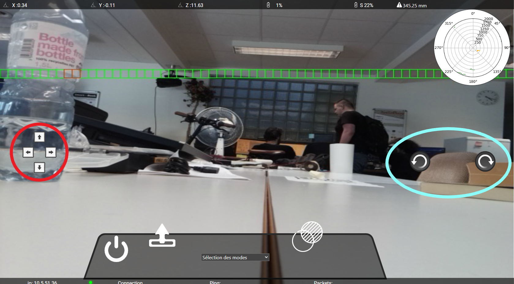
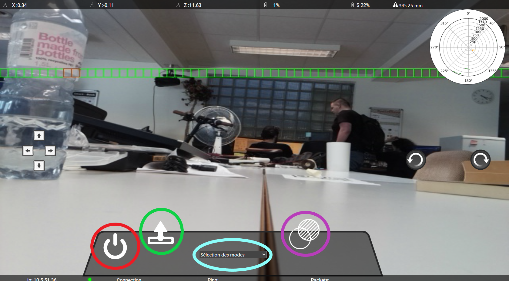
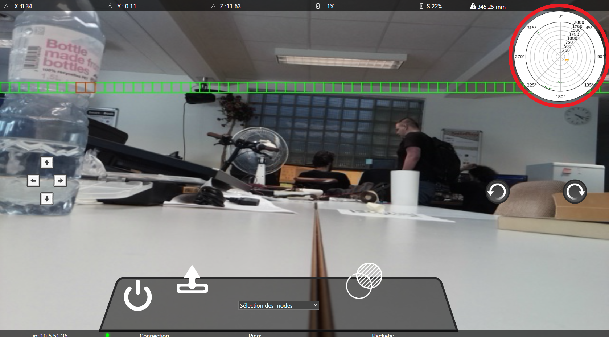
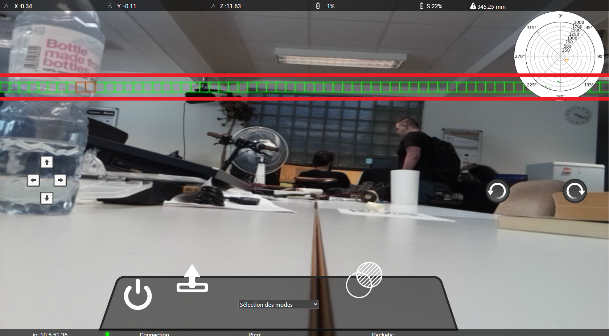

# Manuel utilisateur

## Connection au raspberry pi

la première étape pour pouvoir utiliser est de vous connecter en ssh au raspberry pi.

Veuillez l'allumer

Pendant que le raspberry pi s'allume téléchargez et installez le logiciel <a href="https://putty.org/">puTTY</a>.

Ensuite, allez sur un ordinateur et cherchez votre rasperry pi dans les connections WiFi

{width=500}

Puis, si vous avez bien suivis l'installation, vous pouvez vous connectez au raspberry pi. 

Dès que vous êtes connecté, lancez le programme puTTY et entrez-y l'ip de votre raspberry pi.

{width=500}

Vérifiez que vous soyez bien en SSH.

{width=500}

Puis, entrez le numéro de port 22.

{width=500}

Afin que ce soit plus simple pour les prochaines fois je vous conseille de l'enregistrer en bas, ainsi, les prochaines fois vous n'avez qu'à cliquer dessus pour vous connecter.

{width=500}

Maintenant que vous êtes connecté en SSH au raspberry pi, il vous demandera de vous identifier (comme sur l'image en dessous). Si vous avez tout laisser par défaut voici le login est *pi*.

{width=500}

Ensuite il vous demandera le mot de passe qui, si vous ne l'avez pas changer, est *raspberry*.

{width=500}

## Lancement du programme

Dans cette étape, on va lancer le programme.

Dans le terminal pyTTY, tapez :

```bash

python3 Hexapode/app/app.py

```

Voilà le programme est lancé!

S'il ne s'est pas lancé vérifiez bien que vous avez cloner le répertoire git dans le home du raspberry pi.

Si ce n'est pas le cas, tapez juste

```bash

cd

```

Cette commande vous enverra à l'home du raspberry pi. 

Et maintenant tapez:

```bash

git clone https://github.com/NickVanMarkes/Hexapode.git

```

Puis refaite l'étape du lancement du programme.

## Utilisation du programme

Dès que tout seras bon, le programme vous montrera plein de message, mais surtout l'adresse ip à vous connecter sur vôtre navigateur web.

{width=500}

Tapez cette adresse sur votre navigateur puis vous verrez l'interface web:

{width=700}

## Utilisation de l'interface

### Bannière
Tout d'abord je vous explique les informations que vous retrouvez sur la bannière du haut:

{width=700}

En rouge, nous avons l'orientation du robot sur l'axe X. L'axe X est l'orientation direction la caméra, savoir si le robot est incliné vers l'avant ou vers l'arrière.

En vert, nous avons l'orientation du robot sur l'axe Y. L'axe X est l'orientation direction des pattes, savoir si le robot est incliné vers la gauche ou vers la droite.

En bleu, nous avons l'orientation du robot sur l'axe Z. L'axe Z est l'orientation de rotation du robot, savoir si le robot est tourné vers le nord, sud, est ou ouest.

En violet, il y a le pourcentage de batterie restant sur les deux batteries. La batterie de gauche, est celle pour le raspberry pi (le cerveau du robot), et celle de droite pour les servomoteurs (les muscles du robot).

En brun, nous avons la distance de l'obstacle détécté le plus proche. La distance est toujours affichée en millimètres.

### Boutons de directions

Dans cette partie, je vous explique quels sont les boutons de directions et à quoi ils servent.

{width=700}

En rouge, nous avons quatres boutons. Ces quatres boutons servent à se déplacer comme sur un cadrillage.

- La flèche du haut:

Ce bouton sert à faire avancer le robot d'un pas. Cette touche peut être activée aussi avec la touche **W** du clavier.

- La flèche de gauche:

Ce bouton sert à faire un pas vers la gauche (comme un crabe). Cette touche peut être activée aussi avec la touche **A** du clavier.

- La flèche de droite:

Ce bouton sert à faire un pas vers la droite (comme un crabe). Cette touche peut être activée aussi avec la touche **D** du clavier.

- La flèche du bas:

Ce bouton sert à faire reculer le robot d'un pas.Cette touche peut être activée aussi avec la touche **S** du clavier.

En bleu, nous avons deux boutons qui servent à faire les rotations du robot. 

- La flèche de gauche:

Ce bouton fait faire au robot une rotation anti-horaire. Cette touche peut être activée aussi avec la touche **Flèche de gauche** du clavier.

- La flèche de droite:

Ce bouton fait faire au robot une rotation horaire. Cette touche peut être activée aussi avec la touche **Flèche de droite** du clavier.

### Bandeau

Dans le bandeau, il y a quelques boutons ainsi que le selecteur de modes.

{width=700}

En rouge, c'est le bouton qui sert à éteindre le raspberry pi(ce qui éteindra le robot). Cette touche peut être activée aussi avec la touche **X** du clavier.

En vert, c'est le bouton d'initialisation du robot. Il sert au démarrage de faire lever le robot. Cette touche peut être activée aussi avec la touche **I** du clavier.

En bleu, c'est le selecteur de modes. Il faut cliquer dessus et plusieurs choix de modes s'afficheront, et vous n'avez qu'à cliquer sur le mode que vous voulez et ça le changera.

En violet, c'est le bouton pour changer la transparence de la vue radar. Elle change de blanc à transparent ou vice-versa la vue radar. Cette touche peut être activée aussi avec la touche **T** du clavier.

### Vue Radar

Sur l'interface, en haut à droite, il y a une vue radar, qui montre où sont les obstacles autour du robot.

{width=700}

Dans le cercle rouge, nous avons une vue radar des obstacles autour du robot. Si vous voulez voir plus précisément les obstacles, cliquez dessus et la vue s'agrandira.

### Détecteur d'obstacles Caméra

Sur le retour de la caméra, il y a une ligne de carré qui représente les obstacles les plus proches du robot.

{width=700}

Plus un obstacle sera proche, plus le carré deviendra rouge. Plus il est loin, plus il sera vert.

