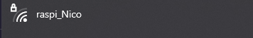
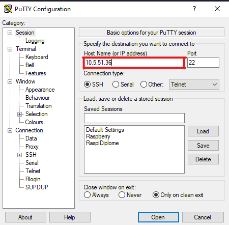
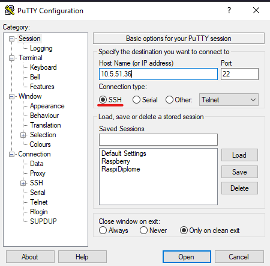
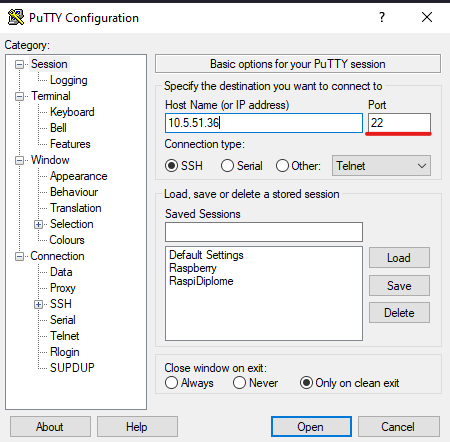
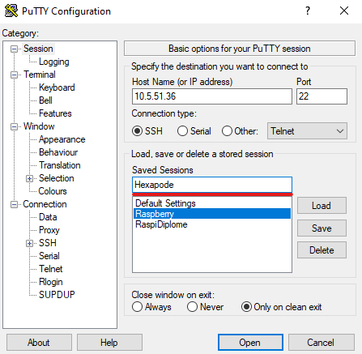
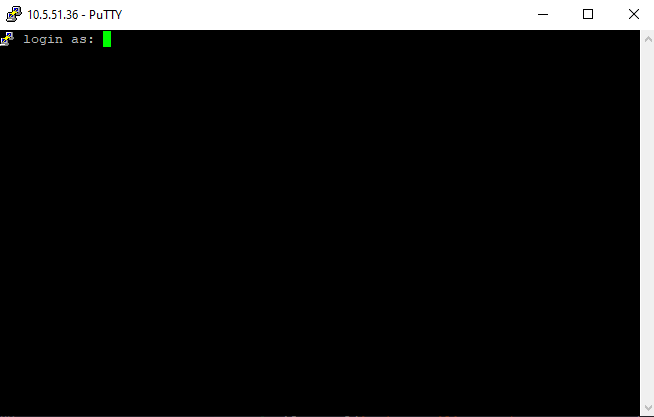
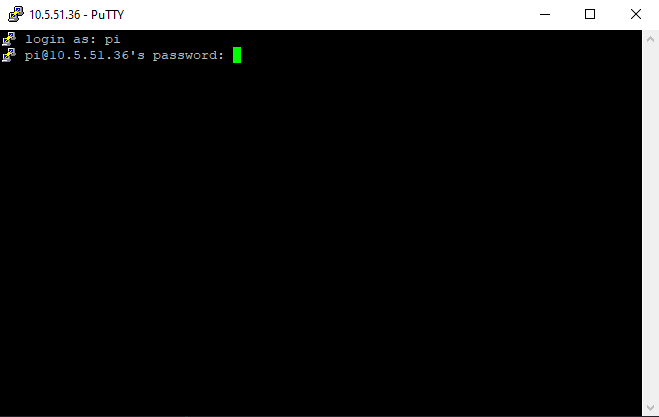
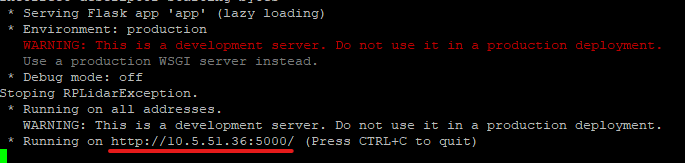
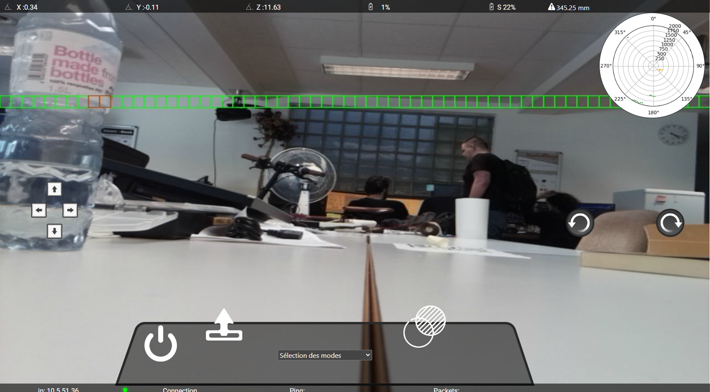

# Manuel utilisateur

## Connection au raspberry pi

la première étape pour pouvoir utiliser est de vous connecter en ssh au raspberry pi.

Veuillez l'allumer

Pendant que le raspberry pi s'allume téléchargez et installez le logiciel <a href="https://putty.org/">puTTY</a>.

Ensuite, allez sur un ordinateur et cherchez votre rasperry pi dans les connections WiFi

{width=500}

Puis, si vous avez bien suivis l'installation, vous pouvez vous connectez au raspberry pi. 

Dès que vous êtes connecté, lancez le programme puTTY et entrez-y l'ip de votre raspberry pi.

{width=500}

Vérifiez que vous soyez bien en SSH.

{width=500}

Puis, entrez le numéro de port 22.

{width=500}

Afin que ce soit plus simple pour les prochaines fois je vous conseille de l'enregistrer en bas, ainsi, les prochaines fois vous n'avez qu'à cliquer dessus pour vous connecter.

{width=500}

Maintenant que vous êtes connecté en SSH au raspberry pi, il vous demandera de vous identifier (comme sur l'image en dessous). Si vous avez tout laisser par défaut voici le login est *pi*.

{width=500}

Ensuite il vous demandera le mot de passe qui, si vous ne l'avez pas changer, est *raspberry*.

{width=500}

## Lancement du programme

Dans cette étape, on va lancer le programme.

Dans le terminal pyTTY, tapez :

```bash

python3 Hexapode/app/app.py

```

Voilà le programme est lancé!

S'il ne s'est pas lancé vérifiez bien que vous avez cloner le répertoire git dans le home du raspberry pi.

Si ce n'est pas le cas, tapez juste

```bash

cd

```

Cette commande vous enverra à l'home du raspberry pi. 

Et maintenant tapez:

```bash

git clone https://github.com/NickVanMarkes/Hexapode.git

```

Puis refaite l'étape du lancement du programme.

## Utilisation du programme

Dès que tout seras bon, le programme vous montrera plein de message, mais surtout l'adresse ip à vous connecter sur vôtre navigateur web.

{width=500}

Tapez cette adresse sur votre navigateur puis vous verrez l'interface web:

{width=700}

